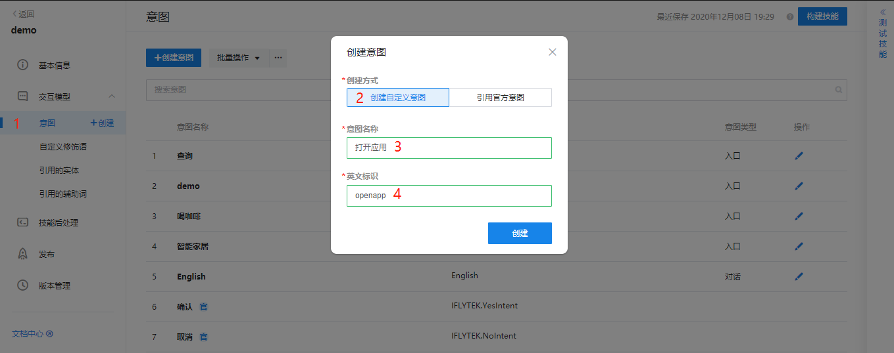
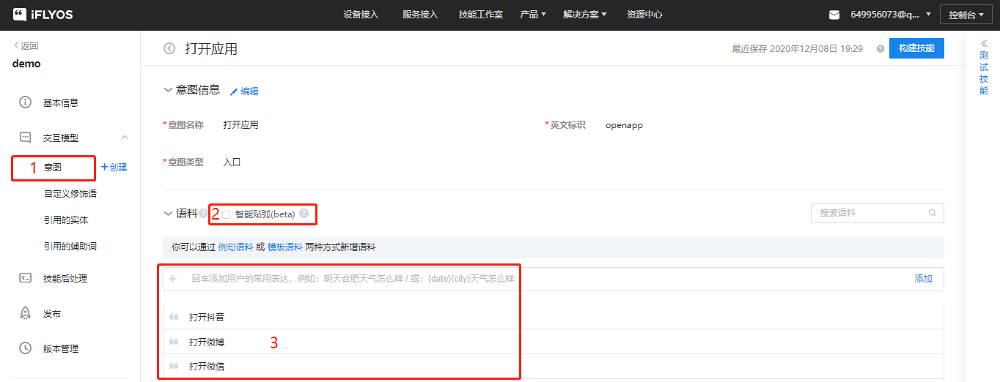
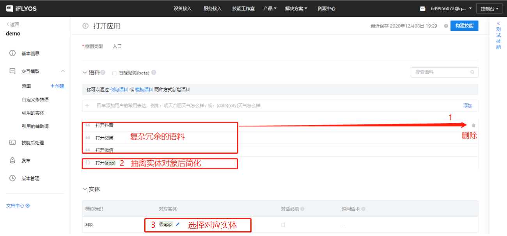
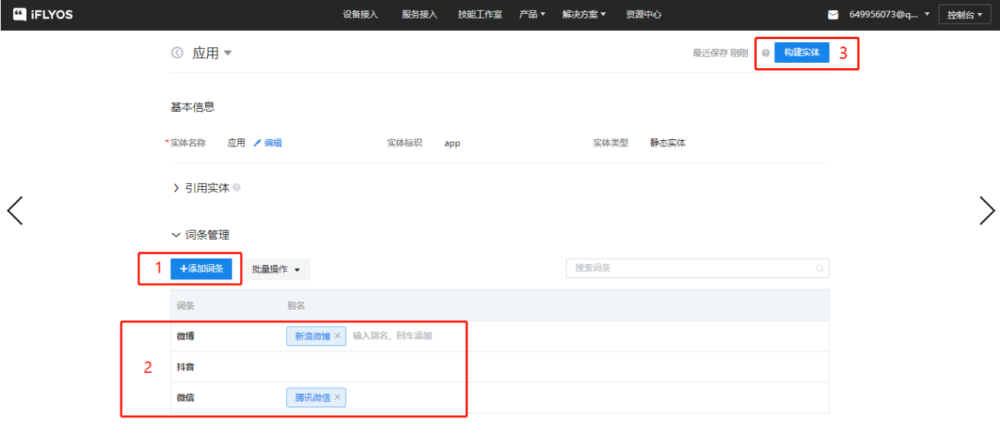
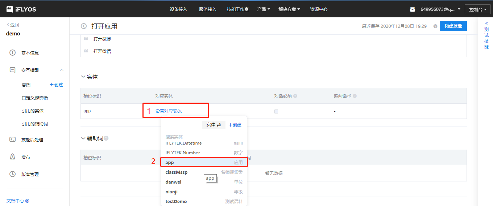
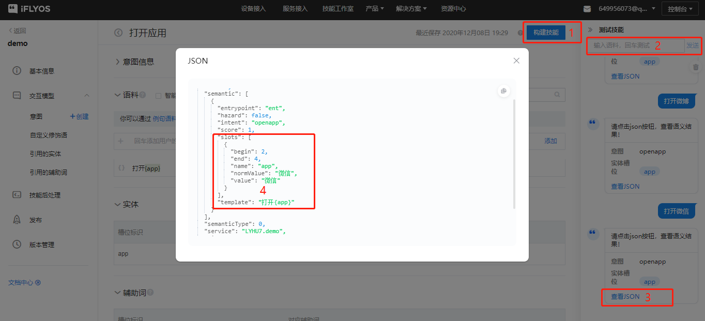
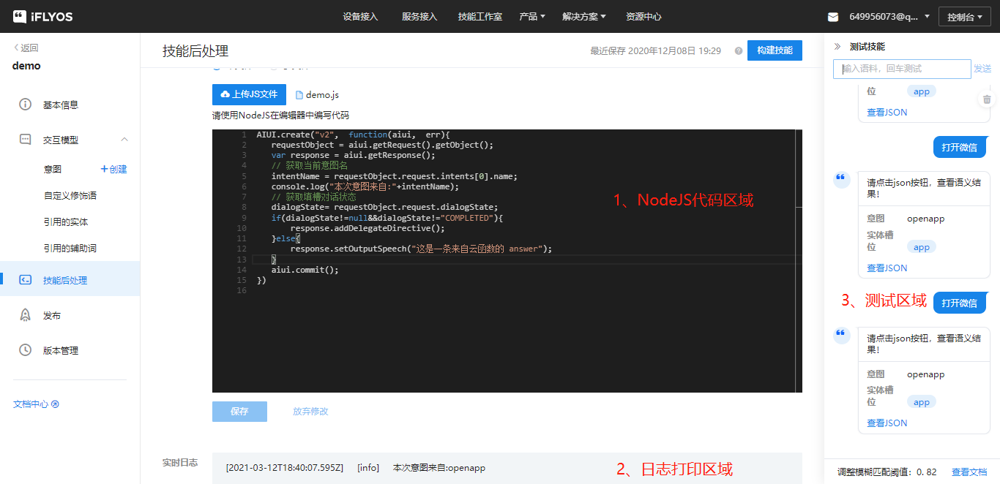
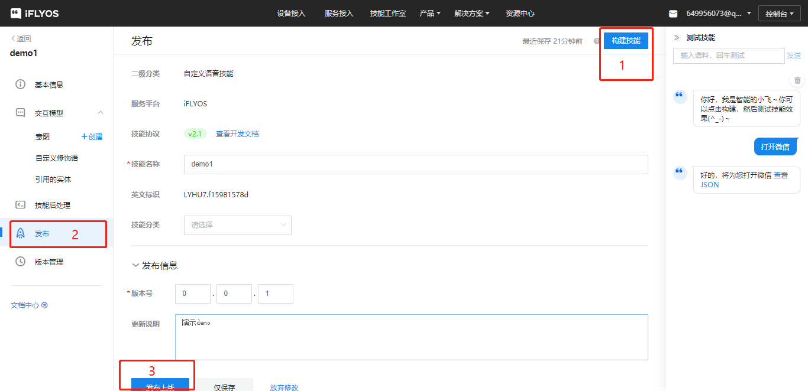

---

id:getting_start
title:离在线语音交互初体验
slug:/CSK_online_guides/Custom_skills

---

> 本文主要介绍如何快算上手体验 LSKits 离在线开发板（CSK+XR872AT），阅读本文后，你将了解到
>
> 1.如何通过【小飞在线】APP在为开发板配网。
>
> 2.如何通过语音交互与配套APP，体验 LSKits 离在线开发板功能。
>
> 3.如何为离在线开发板烧录固件。


## 云端篇
### 一、创建自定义技能
1、进入[技能控制台](https://studio.iflyos.cn/skills)，依次选择：我的技能、创建技能、私有技能、iFLYOS并填写技能名称，如图：


2、创建意图，并填入所需语料(即：期望用户说什么能触发到这个技能)，初期建议开发者取消“智能贴弧”选项，后文将对智能贴弧进行讲解，如图：




3、对语料中的对象进行抽离，定义为“槽”，实体格式以大括号括起即可，括号内表示槽名，可任意命名，每个槽需要有对应的实体表示，实体即抽离的对象合集，一个槽位内放置一个实体，如图：



4、创建实体，填写实体内容并构建实体，实体词条和别名即在语料中抽离的具体对象，英文标识即需要在槽内填充的实体标识名，如图：





5、在意图内勾选所需实体的英文标识，如图：



6、构建技能，测试语料验证，确认是否可以成功命中到对应语料的对应实体，如图：



### 二、自定义技能后处理

1、技能后处理界面主要分为三大区域
>- 代码编写区域
>- 日志打印区域
>- 测试区域

其中代码接口见：[云函数接口文档](https://doc.iflyos.cn/studio/post_process/api_2.1.html)



2、通过后处理代码获取到识别命中的意图或实体，并根据个性化需求将所需字段下发，示例：
```
AIUI.create("v2.1",  function(aiui,  err){
	requestObject = aiui.getRequest().getObject();
	var response = aiui.getResponse();
	var updatedIntent = aiui.getUpdatedIntent();
	// 判断请求类型
	var requestType =requestObject.request.type;
	console.log("技能请求类型为:" + requestType);
	if(requestType === "LaunchRequest"){
		// 会话保持活动状态
		response.withShouldEndSession(false);
	} else if(requestType === "IntentRequest"){
		// 会话保持活动状态
		response.withShouldEndSession(false);
		// 获取当前意图名
		intentName = requestObject.request.intent.name;
		console.log("本次意图来自:" + intentName);
		switch(intentName){
		case 'openapp':
            var appValue = updatedIntent.getSlotValue('app');
        	console.log("本次槽值为:" + appValue);
			response.withShouldEndSession(true);
			response.setOutputSpeech("好的，将为您打开"+appValue);
            break;
		default:
			response.setOutputSpeech("这是一条来自IntentRequest未知意图的 answer");
			break;
		}
	} else if(requestType === "SessionEndedRequest"){
		response.withShouldEndSession(true);
	}
	var directives = [{
 		"type" : "Custom",//设备端处理的话type必须是Custom
		 "payload":{
			 //需要自定义携带的字段写在payload里面
			"aaaa":"AAAAA",
			"bbbb":"BBBBB"
		 },
		 //不能写在payload外面
		 //"xxxxxx":"yyyyy"
 	}];
	response.setDirectives(directives);
	aiui.commit();
})
```
以上技能后处理代码以“打开微信”为例的运行结果如下：
```
//Request结果：
{
    "version": "2.1",
    "context": {
        "AudioPlayer": "",
        "System": {
            "user": {
                "userId": "1615550221673pkjitl"
            }
        }
    },
    "session": {
        "new": true,
        "sessionId": "8dce6882-817b-40f7-989b-c97ac1b01150"
    },
    "request": {
        "type": "IntentRequest",
        "requestId": "web7152f599@dxbadd13a6a4ca3eef00",
        "timestamp": "2021-03-12 20:04:26.798",
        "dialogState": "STARTED",
        "query": {
            "type": "TEXT",
            "original": "打开微信"
        },
        "intent": {
            "name": "openapp",
            "score": 1,
            "confirmationStatus": "NONE",
            "slots": {
                "app": {
                    "confirmationStatus": "NONE",
                    "moreValue": null,
                    "name": "app",
                    "normValue": "微信",
                    "value": "微信"
                }
            }
        }
    }
}
```
```
//Response结果：
{
    "rc": 0,
    "response": {
        "directives": [
            {
                "payload": {
                    "aaaa": "AAAAA",
                    "bbbb": "BBBBB"
                },
                "type": "Custom"
            }
        ],
        "expectSpeech": false,
        "outputSpeech": {
            "text": "好的，将为您打开微信",
            "type": "PlainText"
        },
        "shouldEndSession": true
    },
    "sessionId": "8dce6882-817b-40f7-989b-c97ac1b01150",
    "skill": {
        "reqsrc": "OS",
        "skillAction": "node",
        "skillId": "LYHU7.f15981578d",
        "skillType": "nlis",
        "skillUrl": "athena.iflyos.cn/node",
        "skillVersion": "1.0"
    },
    "version": "2.1"
}
```
从以上结果看出，无论是语料命中的意图还是实体，亦或是我们期望携带的自定义参数，都成功下发出来了。


3、构建并发布技能，如图：



4、在IFLYOS设备的前置拦截器中添加已发布的技能，如图：


5、在IFLYOS设备的模拟中验证自定义技能的语料是否成功，如图：


至此，我们已经完成了云端自定义技能的开发，下一篇将为大家讲解如何从客户端EVS协议中获取到云端下发的结果。


## 客户端篇

### 获得自定义技能意图
> 代码示例
### 获得自定义技能实体
> 代码示例
### 获得自定义技能自定义字段
> 代码示例
