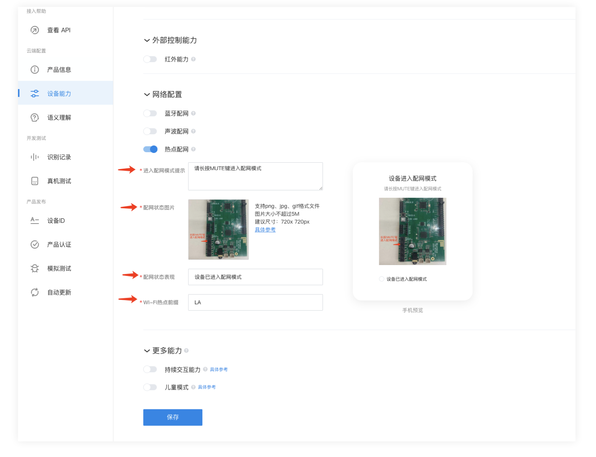
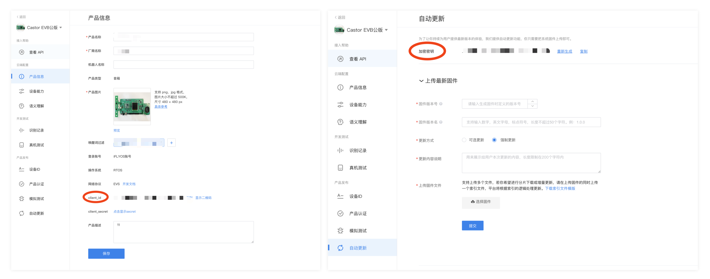
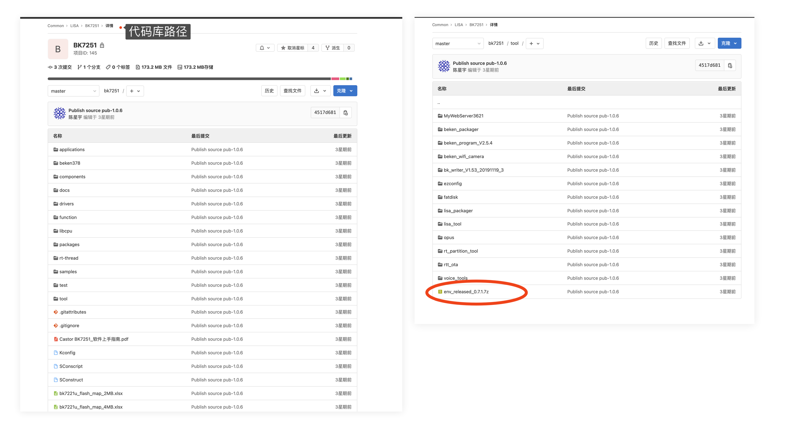
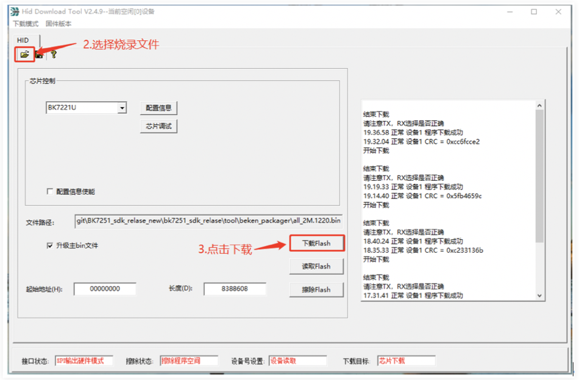

---

id: online_getting_start
title: 快速上手 CSK 离在线项目
slug: /CSK_online_guides/getting_start

---

> 本文主要介绍如何快算上手体验 CSK+BK7251 离在线开发板，阅读本文后，你将了解到
>
> 1.如何在 iFLYOS 平台创建属于自己的设备；
>
> 2.如何获取 BK7251 源码并进行简单的二次开发；
>
> 3.如何编译、烧录 BK7251 固件
>
> 4.如何获取并烧录 CSK 固件；
>
> 5.如何为开发板配网，并上手体验功能。


## 1.做好准备

### 1.1.拥有一个 CSK+BK7251 离在线开发板

本文以 CSK+BK7251 开发板为例，带你快速上手离在线项目。你可以按照 [CSK+BK7251 硬件参考设计](https://open.listenai.com/resource/open/doc_resource%2F%E7%A1%AC%E4%BB%B6%E8%AE%BE%E8%AE%A1%E6%8C%87%E5%8D%97%2F%E5%8E%9F%E7%90%86%E5%9B%BE%26PCB%E8%AE%BE%E8%AE%A1%E5%8F%82%E8%80%83%2FCSK4002%2BBK7251.zip)，自行打板。（适配 LSKIts 的 CSK+BK7251 核心板即将发售，敬请期待）

### 1.2.在 iFLYOS 平台创建属于你的设备

在准备固件前，需要先登录 iFLYOS 平台并创建属于你自己的设备，iFLYOS 是基于人机智能交互技术为开发者开放的语音技术服务系统，接入 iFLYOS 的设备将具备语音交互能力。登录 [iFLYOS](https://device.iflyos.cn/device) 平台并注册账号，选择设备接入后，点击【开始接入】，填写产品基本信息后，你需要选择产品类型，如下图：

**产品类型**：根据你的产品类型自行选择，如果是开发板，可选择【其他】

**操作系统**：选择【RTOS】

**是否有屏**：选择【无屏】

**网络协议**：选择【EVS】


选择产品类型后，你需配置设备能力，其中必备能力是设备必须要实现的能力，默认必须打开。在可选能力中，打开**【语音唤醒】**与**【热点配网】**两项能力。选择完成后，点击下一步，完成设备创建流程。


创建设备后，你需要进行网络配置，当你使用小飞在线 APP 为设备配网时，这里的配置项内容会在 APP 中展示，你可以根据你的产品属性对内容进行设置。

**进入配网模式提示：**BK7251 开发板是通过长按 MUTE 键进入配网模式的，这里可以设置文案：“请长按 MUTE 键进入配网模式”；

**配网状态图片：**可以附上你的开发板图片，并标明 MUTE 键位置，方便配网者快速找到；

**配网状态表现：**此处描述设备已进入配网模式的表现；

**Wi-Fi 热点前缀：**设备打开 AP 热点后，对外显示的热点前缀，你可以根据自己的喜好对前缀进行设置；

在完成网络设置后，别忘了点击页面底部的【保存】按钮。



此外，需要找到设备的 `Client id` 与 `OTA_SECRET`（加密密钥）；`Client_id` 表示该产品的在iFLYOS平台的唯一标识，`OTA_SECRET ` 是请求 iFLYOS OTA 接口时的签名认证，需要记住这两个参数的值，在编译 BK7251 固件时，需要将源码中这两项参数的默认值修改为该产品在 iFLYOS 的值。



:::important

在 iFLYOS 平台设置 Wi-Fi 热点前缀后，还需在固件中同步修改。后面会讲到如何在固件中修改。

:::

### 1.3 在iFLYOS平台导入设备ID白名单

创建设备后，你需要在【设备ID】菜单栏将你的 `Device_id` 导入至白名单中，如下图。`Device_id` 代表产品的设备在 iFLYOS 平台中的唯一标识，只有处于白名单中的 `Device_id`，才会通过平台鉴权，从而获取 iFLYOS 平台的语音服务。`Device_id` 格式可自己定义，导入后会在【已导入设备】一栏展示。


### 1.4.增加小飞在线测试账号

在创建设备并完成上述配置后，由于你的设备并未正式发布，普通用户无法在小飞在线 APP 查找到你的设备，你需要在【真机测试】菜单栏增加手机号白名单，处于白名单中的用户输入手机号登录小飞在线后，能够查看到尚未正式发布的设备。


### 1.5.下载小飞在线APP

你需要使用【小飞在线】APP 为开发板进行配网，[点击此处](https://www.iflyos.cn/download/app/)下载。下载完成后，输入手机号码登录/注册。


### 1.6.下载安装 LStudio

LSTudio 主要用于 CSK 固件配置与烧录，在 CSK 项目开发指南中的[《快速入门CSK项目开发》](https://open.listenai.com/getting_start)已详细说明如何下载安装 LStudio，本文不再做过多描述。


## 2.制作CSK离在线固件

做好上述准备工作后，接下来需要制作你的第一个离在线固件，包括 CSK 固件与 BK7251 固件，你需要分别编译并烧录在开发板中。

### 2.1.制作CSK4002固件

LSTudio 目前暂未支持适配 BK7251 芯片的 CSK固件（即将支持），可[点击此处](https://open.listenai.com/resource/open/doc_resource%2F%E6%AD%A6%E5%99%A8%E5%BA%93%2FCSK4002%E5%9B%BA%E4%BB%B6%EF%BC%88%E9%80%82%E9%85%8Dbk7251%EF%BC%89.zip)下载CSK固件。

### 2.2.固件烧录

由于 LSTudio 暂未支持该方案的 CSK 固件打包，所以烧录固件需要先下载 [CSK 烧录工具](https://open.listenai.com/resource/open/doc_resource%2F%E9%87%8F%E4%BA%A7%E6%8C%87%E5%8D%97%2F%E6%A8%A1%E7%BB%84%E7%83%A7%E5%BD%95%2Fcastor-factory-tool-setup-v1.0.0.10.exe)与 CSK 固件。

- 下载完毕后，运行烧录工具，点击【安装 USB 驱动】，安装 CSK 的驱动；

- 安装完毕，将 USB 线连接至开发板，并按下开发板的【自锁按键】（见下图标注）；
- 点击烧录工具中的【 USB 烧录】，固件路径选择你存放 CSK 固件的路径，之后点击【开始烧录】；
- 将电脑与开发版通过 USB 连接，烧录工具会自动开始固件烧录；
- 烧录完成后，在烧录工具中选择【停止烧录】，之后松开开发板的【自锁按键】。


### 2.3.固件运行

- 用跳帽短接上图的【PW_EN】和【GND】排针（由于 BK7251 暂时没有控制 CSK 上电的逻辑，所以强制 CSK 上电）；
- 通过 USB 向开发板供电；
- 将上图中的【 CSK 调试串口】通过串口线与电脑相连，查看 CSK 芯片是否运行正常，唤醒是否正常响应。（唤醒词是小飞小飞）


## 3.制作BK7251固件

### 3.1.固件编译环境搭建

首先声明，请在 Windows7/10 操作系统下编译固件，LINUX 暂未实践；由于 BK7251 采用 rtthread 实时操作系统，故软件编译环境主要依据 rtthread 的要求设置。

登录 LSCloud ，找到 BK7251 代码库并下载至电脑，路径如下图；Windows 下的 rtthread 编译工具为 env ；可在代码目录的 \tool\ 下找到 env_released_0.7.1.7z，如下图。将编译工具解压至代码库同一文件目录下。




进入 \env_released_0.7.1\env\ 下打开 env.exe （免安装）。即可进入env控制台，界面如下图：


:::tip

\tool\env_released_0.7.1\env 目录下有一张 Add_Env_To_Right-click_Menu.png  (添加 env 至右键菜单.png) 的图片，根据图片上的步骤操作，就可以在任意文件夹下通过右键菜单来启动 env 控制台。

:::

### 3.2.修改固件信息

在编译固件前，你需要修改固件的基础关键信息，保证烧录后的固件可用。

- 根据目录  **/applications/lisa/lisa_app/lisa_evs/evs_opts.h**  找到固件中默认的 Client_id 与 SECRET_OTA ，将参数值修改为 **1.2** 中 iFLYOS 产品对应的值。

- 修改热点前缀，需要将固件中的 WiFi 热点前缀，与你在iFLYOS中设置的保持一致。可在 **evs_netconfig.c** 文件中修改，如下：

  ```c
  void
  evs_net_config_begin(evs_net_config_t *handle)
  {
  	handle->m_is_config = true;
  	handle->m_wifi_connect = false;
  	handle->m_client->m_is_configing = true;
  	handle->m_link_ssid[0] = '\0';
  	handle->m_link_pwd[0] = '\0';
  	handle->m_link_usr_code[0] = '\0';
  	handle->m_refresh_token[0] = '\0';
      // 前缀修改
  	char ap_name[7] = "LA_";
  	char device_id[65];
  	strcpy(device_id, evs_client_get_deviceid());
  	int pos = strlen(device_id) - 3;
  	strncpy(ap_name + 3, device_id + pos, 3);
  	ap_name[6] = '\0';
      // 修改前缀示例
      // char ap_name[9] = "LISA_";
  	// char device_id[65];
  	// strcpy(device_id, evs_client_get_deviceid());
  	// int pos = strlen(device_id) - 3;
  	// strncpy(ap_name + 5, device_id + pos, 3);
  	// ap_name[8] = '\0';
  	evs_aplinker_stop_link(handle->m_ap_linker);
  	evs_timer_stop(handle->m_accept_timer);
  	evs_timer_stop(handle->m_data_timer);
  	evs_timer_stop(handle->m_reconnect_timer);
  	evs_timer_set_timeout(handle->m_accept_timer, _on_accept_time_out, AP_LINKER_ACCEPT_TIMEOUT);
  	evs_soundplayer_play(handle->m_sound_player, get_tone_url(TONE_ID_8));
  	evs_client_stop(handle->m_client);
  	handle->m_wifi_mgr->wifi_disconnect();
  	evs_aplinker_start_link(handle->m_ap_linker, ap_name);
  }
  ```


### 3.3.固件编译

在env环境下进⼊ SDK 根⽬录后，可通过命令实现固件编译、清除、打包。

- 编译，可输入 `scons -j4` 执行编译，编译完成后随即生成 rtt 固件 rtthread.bin。如下图：


  

- 清除，可输入 `scons -c` 执行清除，清除完毕提示如下图：


  

- 打包，在SDK 路径下 \tool\lisa_packager\ 下执行 `beken_packager.exe` 或 `beken_packager.bat` ，即可。


  

### 3.4.固件烧录

BK7251 组件主要分为 boot+app+其他分区组件（例如本地提示⾳）。**全组件需使⽤ SPI 烧录，单独 APP 使⽤ UART 烧录⽅式。通常来说刚拿到芯片时，boot 分区都是未曾烧录的，需要开发者使用 SPI 烧录器为芯片烧录全组件。SPI 烧录器需要另外购买，有需要可联系聆思商务。**boot 分区一经烧录，后续烧录均可通过 UART 的方式进行。下图标注了 SPI 烧录与 UART 烧录的入口。


#### SPI烧录

首先需要准备 SPI 烧录器，如下图：


随后，在 \tool\lisa_tool\download tool_spi 目录下找到烧录软件 HID Flash Download Tool(1).exe。将 SPI 烧录器的硬件 SPI 烧录接⼝插到开发板上的 BK7521 SPI 烧录⼝，此时注意需要让开发板的 CSK ⾃锁按键处于**抬起状态**；最后打开烧录软件，按照下图操作进行烧录即可。




#### UART烧录

因为串⼝烧录⼀般采⽤ 1Mbps 的烧录速率，所以推荐采⽤ CH340 的 USB 转串⼝⼯具。如下图所示：


在源码目录 \tool\lisa_tool\download tool_uart 下找到烧录软件 bk_writer_V1.52.exe ，选择固件并烧录。如下图


#### 写入 Device_id

如果开发板第一次烧录固件，或你之前通过命令行、SPI烧录软件擦除了固件中的 `Device_id`。在烧录固件后，你需要为固件写入 `Device_id` 。可在串口工具中输入命令行：`lisa_perst set string device_id   {id内容}` 完成写入（注意空格）。`Device_id` 可在 iFLYOS平台导入，在1.3中已做讲解，此处不做过多讲解。

:::tip

如果烧录前 bk7251 开发板的串口没能正常工作，则需要重启开发板使串口进入正常工作。

:::


## 4.上手体验

### 4.1.为设备配网

打开小飞在线 APP，登录按照下图操作流程为开发板配网：

- 打开 APP，进入底部【我的】菜单栏，点击页面顶部的【添加主控设备】。若你有多台设备，可在顶部卡片区域一直左滑，直至出现【添加主控设备】按键；
- 在设备列表中选择你的设备（注意你的小飞在线账号一定要在白名单中，否则此处查找不到设备），进入下一步；
- 输入 WiFi 账号与密码，如果是安卓手机，会自动获取当前正在连接的 WiFi 信息；如果是 IOS 手机，第一次需要手动输入 WiFi 账号密码，之后选择记住密码，以后配网会自动填充；输入 WiFi 信息后，进入下一步；
- 长按开发板中的 MUTE 键，听到开发板播报已进入配网模式的提示音后，在 APP 端勾选【设备已进入配网模式】选项，点击下一步；
- 如果是 IOS 手机，需要按照指引，切换至系统设置中的无线局域网页面，选择待热点前缀的热点并连接，连接成功后，再切换回小飞在线 APP；（安卓手机会自动寻找热点并连接，无需手动操作）
- APP端显示正在配网中，IOS 手机此处等待时间较长，最长可能需要20s，请耐心等待；安卓手机较快；
- 配网成功后，APP端会展示成功提示，此时设备端也会播报联网成功的TTS，配网流程结束；


### 4.2.“小飞小飞，今天天气怎么样”

配网成功！你可以通过语音与开发板交互了，iFLYOS 平台集成了上百个语音技能，以及千万级级音频资源，足以覆盖用户绝大多数的使用场景。你可以[点击此处](https://www.iflyos.cn/skills)查看技能介绍与常用说法。

你可以试着说：

“小飞小飞，今天天气怎么样？”

“小飞小飞，给我讲个故事。”

“小飞小飞，帮我定个三点的闹钟。“

:::tip

音乐属于付费资源，需要单独付费，如果希望在开发板上体验音乐，可联系聆思商务开通音乐权限。

:::


## 了解更多

你可以阅读以下文档，快速理解CSK离在线方案原理：

- **[开发者指引](/CSK_online_guides/developer_guides)**

如果你有其他WiFi芯片，想要接入CSK离在线方案，你可以参考：

- **[LISA API](https://open.listenai.com/resource/open/doc_resource%2F%E9%87%8F%E4%BA%A7%E6%8C%87%E5%8D%97%2F%E6%A8%A1%E7%BB%84%E7%83%A7%E5%BD%95%2Fcastor-factory-tool-setup-v1.0.0.10.exe)**

如果需要进行固件开发

- **[上位机固件常用功能二次开发](/CSK_online_guides/secondary_development)**

在项目开发过程中如果需要帮助，可以通过工单系统向我们获取技术支持：

- **[工单系统](https://open.listenai.com/cloud_project)** 

