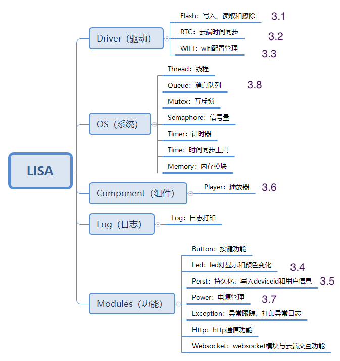

## 1. 概述

`lisa_api` 是聆思基于市场主流的 RTOS 和芯片平台，定义的一个介于底层驱动与上层应用的中间层架构。开发者需要基于 `lisa_api` ,对需要调用的硬件平台和实时操作系统接口抽象封装，这些抽象出的接口将为上层应用提供能力。

此外，在接入 `lisa_api` 架构后，由于上层调用了 `lisa_api` 定义的标准接口，后续更换不同的芯片平台时，上层应用无需修改，只需做底层驱动的适配工作，这将减少平台迁移工作量，避免重复工作。

:::info

以下接口使用用例基于 XR872 的 RTOS 平台，可移植于其他平台的 RTOS 测试。

:::

### 软件系统架构

适配872或者其他RTOS芯片平台，系统架构：


LISA API适配层封装接口：



[查看lisa api 接口文档](./lisa_api.md)

### 语音云对接

我们推荐云端对接一站式语音云 iFLYOS， 但 iFLYOS 云端对接目前需要自己实现，云端交互使用EVS协议，EVS协议说明及接入方法参考[设备接入介绍](https://doc.iflyos.cn/device/)。

你也可以对接其他语音云服务，如：[AIUI](https://aiui.xfyun.cn/doc/aiui/sdk/more_doc/webapi/summary.html)等。


## 2. 业务代码说明

### 源码路径

XR872 适配 lisa api代码路径

```
https://cloud.listenai.com/private/xr872_lisa
```

:::info

若无权限访问，请联系FAE开通权限。

:::

### 目录结构

代码目录结构及说明

```
|-- drivers                  // 驱动层接口
|   |-- hal_flash.c          // flash 读写接口
|   |-- hal_flash.h
|   |-- hal_rtc.c            // 获取和设置时钟，用于云端时钟同步
|   |-- hal_rtc.h  
|   |-- hal_wifi.c           // wifi管理工具
|   `-- hal_wifi.h
|-- lisa_common              // 操作结果返回值
|   |-- err.h                         
|   `-- typedef.h
|-- lisa_component           // 音频播放管理工具
|   |-- lisa_player.c
|   `-- lisa_player.h
|-- lisa_log                 // 日志工具
|   `-- log.h
|-- lisa_os                  // 系统模块
|   |-- mem.c                // 系统内存管理工具
|   |-- mem.h
|   |-- mutex.c              // 互斥量管理工具
|   |-- mutex.h 
|   |-- queue.c              // 消息队列工具  
|   |-- queue.h
|   |-- semaphore.c          // 信号量管理
|   |-- semaphore.h
|   |-- thread.c             // 线程管理工具
|   |-- thread.h  
|   |-- time.c               // 时间同步工具
|   |-- time.h 
|   |-- timer.c              // 计时器工具
|   `-- timer.h
|-- lisa_test                // lisa api接口使用示例
|   |-- hal_flash_demo.c     // flash读写示例
|   |-- hal_rtc_demo.c       // 时间同步使用示例
|   |-- hal_wifi_demo.c      // wifi网络配置管理示例
|   |-- lisa_button_demo.c   // 按键接口使用示例
|   |-- lisa_demo.c          // lisa api接口使用主程序
|   |-- lisa_demo.h    
|   |-- lisa_led_demo.c      // led灯控制示例
|   |-- lisa_perst_demo.c    // 持久化工具使用示例
|   |-- lisa_player_demo.c   // 音频播放器使用示例
|   |-- lisa_power_demo.c    // 电源管理模块使用示例
|   `-- lisa_queue_demo.c    // 消息队列使用示例
`-- modules                  // lisa功能模块
    |-- hal_http.c           // http 通信功能模块
    |-- hal_http.h
    |-- hal_websocket.c      // websocket长连接通信模块，用于云端交互
    |-- hal_websocket.h
    |-- lisa_button.c        // 按键实现模块，主要是长按，短按模拟功能
    |-- lisa_button.h
    |-- lisa_exception.c     // 异常捕获功能模块
    |-- lisa_exception.h
    |-- lisa_led.c           // led灯功能模块
    |-- lisa_led.h
    |-- lisa_perst.c         // 持久化工具功能模块
    |-- lisa_perst.h
    |-- lisa_power.c         // 电源管理功能模块
    `-- lisa_power.h
```

## 3. Lisa 接口使用示例

​	为了帮助开发者更好的理解`lisa_api`，本文档将通过 Drivers（驱动）、Component（组件）、Log（日志）、OS（系统）、Modules（功能模块）五方面详细介绍 lisa_api。

为使开发者正确快速使用lisa接口，我们提供了一些lisa api使用demo示例，demo目录是：
```
https://cloud.listenai.com/private/xr872_lisa/lisa_test
```

测试示例使用lisa_api串口命令的方式体验，具体命令如下：

```
lisa_api rtc_test set
lisa_api rtc_test get
lisa_api button_test init

lisa_api led_test breath 1
lisa_api led_test breath 2
lisa_api led_test breath 3
lisa_api led_test off
lisa_api led_test on 1

lisa_api perst_test set string ftshen 123
lisa_api perst_test get string ftshen
lisa_api perst_test del string ftshen
lisa_api perst_test info

lisa_api queue_test init

lisa_api power_test reboot

lisa_api wifi_test init
lisa_api wifi_test connect iflytek-yycs iflytekyuyin
lisa_api wifi_test disconnect
lisa_api wifi_test ap ftshen
lisa_api wifi_test status

lisa_api player_test 1 -s http://isure6.stream.qqmusic.qq.com/C200001GuWCx14Gng9.m4a?guid=2000001471&vkey=8B7F53001C83CF9EF18ED8399A77086BA2BD56991218507E1542FAA8F8026189503C6FB0BD1E9ED1FEB13AA5DE8B77EDE0B1792D661FD748&uin=&fromtag=204
lisa_api player_test 1 -p
lisa_api player_test 1 -r
lisa_api player_test 1 -k 12000
```

### Drivers（驱动）

#### 3.1 Flash驱动接口使用

**主要接口：**
- Flash数据写入`lisa_flash_write()`
- Flash数据读取`lisa_flash_read()`
- Flash数据擦除`lisa_flash_erase()`

**实际使用：**读取flash中存储的提示音

```c
void
lisa_flash(int argc, char *argv[])
{
  uint32_t address, len;// 声明操作地址和长度
  void *data;
  if (argc < 4) {
​    LISA_LOGE(TAG, "usage: %s write/read/erase addr len\r\n", argv[0]);
​    return;
  }
  address = atoi(argv[2]);
  len = atoi(argv[3]);
  if (len > sizeof(buf)) {
​    len = sizeof(buf);
  }

  LISA_LOGE(TAG, "address 0x%x len:%d\r\n", address, len);

  if (strcmp(argv[1], "write") == 0) {
​    for (uint8_t i = 0; i < len; i++) {
​      buf[i] = i;
​    }
​    lisa_flash_write(address, buf, len);// Flash数据写入函数调用
  } else if (strcmp(argv[1], "read") == 0) {
​    for (uint8_t i = 0; i < len; i++) {
​      buf[i] = 0;
​    }
​    lisa_flash_read(address, buf, len);// Flash数据读取函数调用
​    for (uint8_t i = 0; i < len; i++) {
​      LISA_LOGE(TAG, "rec:0x%x\r\n", buf[i]);
​    }
  } else if (strcmp(argv[1], "erase") == 0) {
​    lisa_flash_erase(address, 4096);// Flash数据擦除函数调用
  }
}
```

#### 3.2 时间同步接口使用

**主要接口：**
- 时间同步接口使用`lisa_rtc_get()` 
- 获取当前时间后设置当前时间`lisa_rtc_set()`

**实际使用**：在接入evs时，需要进行云端授权，可以使用此接口同步网络时间。

```c
void
rtc_test(int argc, char *argv[])
{
  lisa_time_t time;
  uint8_t set = 0;

  if (argc < 2) {
​    LISA_LOGE(TAG, "usage: %s set|get\r\n", argv[0]);
​    return;
  }

  lisa_rtc_get(&time);// 获取当前时间
  if ('s' == argv[1][0]) {
​    set = 1;
  } else {
​    set = 0;
  }

  if (set) {
​    time.year = 2013;
​    time.month = 11;
​    time.day = 12;
​    time.hour = 13;
​    time.minute = 14;
​    time.second = 15;
​    lisa_rtc_set(&time);// 设置系统时间
  } else {
​    lisa_rtc_get(&time);
  }
}
```

#### 3.3 wifi接口使用

示例展示

**主要接口：**

- wifi初始化`lisa_wifi_init()`
- 连接指定的ssid网络`lisa_wifi_connect()`
- 断开网络`lisa_wifi_disconnect()`
- 开启扫描热点`lisa_wifi_start_scan()`
- 网络状态查询`lisa_wifi_is_connected()`
- 开启热点`lisa_wifi_start_ap()`


**实际应用：**在模组配网时，需要用到这些接口配置网络。

```c
void
hal_wifi_demo(int argc, char *argv[])
{
  if (argc == 1) {
​    wifi_usage();
​    return;
  }

  if (strcmp(argv[1], "init") == 0) {
​    lisa_wifi_init();// wifi功能初始化
  } else if (strcmp(argv[1], "connect") == 0) {
​    lisa_wifi_connect_t test_connect;
​    test_connect.ssid = argv[2];
​    test_connect.password = argv[3];
​    test_connect.on_event = wifi_event_callback_test;
​    lisa_wifi_connect(&test_connect);// 连接指定ssidwifi
  } else if (strcmp(argv[1], "disconnect") == 0) {
​    lisa_wifi_disconnect();// 断开网络
  } else if (strcmp(argv[1], "scan") == 0) {
​    lisa_wifi_start_scan(NULL);// 扫描附近网络
  } else if (strcmp(argv[1], "ap") == 0) {
​    lisa_err_t result = LISA_OK;
​    lisa_wifi_ap_t temp_ap;
​    memset(temp_ap.ssid, 0, sizeof(temp_ap.ssid));
​    memset(temp_ap.password, 0, sizeof(temp_ap.password));
​    memcpy(temp_ap.ssid, argv[2], strlen((char *)argv[2]) + 1);
​    if (argc == 4) {
​    } else if (argc == 5) {
​      memcpy(temp_ap.password, argv[3], strlen((char *)argv[3]) + 1);
​    }
​    temp_ap.ch = 11;
​    result = lisa_wifi_start_ap(&temp_ap); // 开启热点功能

​    if (result != LISA_OK) {
​      LISA_LOGD(TAG, "wifi start failed! result=%d", result);
​    }

  } else if (strcmp(argv[1], "status") == 0) {
​    if (lisa_wifi_is_connected()) { // 获取wifi连接状态
​      LISA_LOGD(TAG, "wifi connected!");
​    } else {
​      LISA_LOGD(TAG, "wifi disconnected!");
​    }
​    return;
  }
  return;
}
```

### OS（系统）

#### 3.4 队列接口使用

**主要接口：**
- 创建对接`lisa_queue_create()`
- 线程写队列`lisa_queue_push()`
- 读取队列中线程`lisa_queue_receive()`

**实际使用：**可用于处理多个消息任务，如处理云端返回的提示音，音乐等信息

```c
#define TAG "lisa_queue"
#define LISA_TEST_STACK_SIZE (5 * 1024)

static lisa_queue_t *g_lisa_queue;

static void
thread1_entry(void *parameter)
{
	char buf[10];
	uint8_t cnt = 0;
	int ret = LISA_OK;
	LISA_LOGI(TAG, "thread1_entry run");
	while (1) {
		ret = lisa_queue_receive(g_lisa_queue, &buf, sizeof(buf), LISA_WAIT_FOREVER); //在消息队列中处理接收的消息 
		if (ret == LISA_OK) {
			for (uint8_t i = 0; i < 10; i++) {
				LISA_LOGE(TAG, "rev: %d", buf[i]);
			}
		} else {
			LISA_LOGE(TAG, "thread1 queue failed =%d", ret);
		}
	}
}

static void
thread2_entry(void *parameter)
{
	char buf[10];
	uint8_t cnt = 0;
	LISA_LOGE(TAG, "thread2_entry run");

	while (1) {
		for (uint8_t i = 0; i < 10; i++) {
			buf[i] = i + cnt;
		}

		lisa_queue_push(g_lisa_queue, &buf, sizeof(buf), 0); // 将消息线程写入队列

		lisa_thread_mdelay(10000);
		LISA_LOGE(TAG, "thread2_entry run");

		cnt += 1;
	}
}

void
lisa_queue(int argc, char *argv[])
{
  lisa_err_t ret;
  g_lisa_queue = lisa_queue_create(1000, "text_qu1", 10); // 队列初始化

  lisa_thread_attr_t lisaAttr1;
  lisaAttr1.name = "lisaThread1";
  lisaAttr1.priority = OS_THREAD_PRIO_APP;
  lisaAttr1.stack_size = LISA_TEST_STACK_SIZE;
  lisa_thread_t *thread1 = lisa_thread_create(&lisaAttr1, thread1_entry, NULL);
  if (thread1 != NULL) {
​    LISA_LOGE(TAG, "thread1_entry create suc!");
  } else {
​    LISA_LOGE(TAG, "thread1_entry create err!");
  }

  lisa_thread_attr_t lisaAttr2;
  lisaAttr2.name = "lisaThread2";
  lisaAttr2.priority = OS_THREAD_PRIO_APP;
  lisaAttr2.stack_size = LISA_TEST_STACK_SIZE;
  lisa_thread_t *thread2 = lisa_thread_create(&lisaAttr2, thread2_entry, NULL); // 创建消息线程
  if (thread2 != NULL) {
​    LISA_LOGE(TAG, "thread2_entry create suc!");
  } else {
​    LISA_LOGE(TAG, "thread2_entry create err!");
  }
}
```

### Component（组件）


#### 3.5 播放器组件的接口使用

**主要接口：**
- 播放器初始化`lisa_player_init()`
- 传入播放音频`lisa_player_prepare_url()`
- 开始播放`lisa_player_play()`
- 暂停播放`lisa_player_pause()`
- 继续播放`lisa_player_resume()`
- 停止播放`lisa_player_stop()`
- 设置播放音量`lisa_player_set_volume()`
- 播放进度控制`lisa_player_seek()`
- 获取播放器状态`lisa_player_get_state()`
- 获取音频长度`lisa_player_get_duration()`

**实际使用：**可以用于网络音频播放，tts播放，播放音量设置及获取音乐播放进度等。

```c
void
player_test(int argc, char *argv[])
{
  if (argc == 1) {
​    usage();
​    return;
  }

  uint8_t type = atoi(argv[1]);

  if (strcmp(argv[2], "-s") == 0) {
​    printf("player%d start in\n", type);
​    if (1 == type) {
​      if (NULL == g_player1) {
​        lisa_player_params_t para;
​        memset(&para, 0, sizeof(lisa_player_params_t));
​        para.type = LISA_PLAYER_TYPE_ONE;
​        g_player1 = lisa_player_init(&para); // 播放器初始化
​        lisa_player_set_callback(g_player1, player1_test_cb);// 设置播放事件回调
​      }

​      lisa_player_prepare_url(g_player1, argv[3]); // 准备播放网络音频资源

​      lisa_player_play(g_player1); // 开始播放

​    } else {
​      if (NULL == g_player2) {
​        lisa_player_params_t para;
​        memset(&para, 0, sizeof(lisa_player_params_t));
​        para.type = LISA_PLAYER_TYPE_TWO;
​        g_player2 = lisa_player_init(&para);
​        lisa_player_set_callback(g_player2, player2_test_cb);
​      }

​      lisa_player_prepare_url(g_player2, argv[3]);

​      lisa_player_play(g_player2);
​    }

​    printf("player%d start out\n", type);
  } else if (strcmp(argv[2], "-p") == 0) {
​    printf("player%d pause in\n", type);
​    if (1 == type) {
​      lisa_player_pause(g_player1); // 暂停播放
​    } else {
​      lisa_player_pause(g_player2);
​    }
​    printf("player%d pause out\n", type);
  } else if (strcmp(argv[2], "-r") == 0) {
​    printf("player%d resume in\n", type);
​    if (1 == type) {
​      lisa_player_resume(g_player1); // 恢复播放
​    } else {
​      lisa_player_resume(g_player2);
​    }
​    printf("player%d resume out\n", type);
  } else if (strcmp(argv[2], "-t") == 0) {
​    printf("player%d stop in\n", type);
​    if (1 == type) {
​      lisa_player_stop(g_player1); // 停止播放
​    } else {
​      lisa_player_stop(g_player2);
​    }
​    printf("player%d stop out\n", type);
  } else if (strcmp(argv[2], "-v") == 0) {
​    uint8_t volume = atoi(argv[3]);
​    printf("player%d set volume%d in\n", type, volume);
​    if (1 == type) {
​      lisa_player_set_volume(g_player1, volume); // 设置播放音量
​    } else {
​      lisa_player_set_volume(g_player2, volume);
​    }
​    printf("player%d set volume%d in\n", type, volume);
  } else if (strcmp(argv[2], "-d") == 0) {
​    dump_status(type);
  } else if (strcmp(argv[2], "-k") == 0) {
​    uint32_t seek = atoi(argv[3]);
​    if (1 == type) {
​      lisa_player_seek(g_player1, seek); // 指定播放位置，开始播放
​    } else {
​      lisa_player_seek(g_player2, seek);
​    }
​    printf("player%d seek %d\n", type, seek);
  }

  return;
}
```

### Modules（功能）


#### 3.6 led灯控制操作

示例主要展示led打开，关闭，呼吸灯实现函数。

**主要接口：**
- LED初始化`lisa_led_init()`
- LED灯控制`lisa_rgbled_ctr()`

**实际使用**：可用于显示网络状态变化，比如网络未连接，网络连接中，网络已连接。也可以用于交互状态显示，如拾音中，正在识别，播放提示音等。

```c
void
lisa_led(int argc, char *argv[])
{
  lisa_led_mode_e mode;
  uint32_t rgb;
  uint16_t cnt = 0;

  if (argc < 2) {
​    LISA_LOGE(TAG, "usage: %s breath|on|off|flash RGB cnt\r\n", argv[0]);
​    return;
  }

  lisa_led_init();// led初始化

  if (strcmp(argv[1], "breath") == 0) {
​    rgb = atoi(argv[2]);
​    mode = LED_MODE_BREATH; //设置模式，呼吸灯模式
​    LISA_LOGE(TAG, "breath 0x%x\r\n", rgb);

  } else if (strcmp(argv[1], "on") == 0) {
​    rgb = atoi(argv[2]);
​    mode = LED_MODE_ON; // 打开灯
​    LISA_LOGE(TAG, "on 0x%x\r\n", rgb);
  } else if (strcmp(argv[1], "off") == 0) {
​    rgb = atoi(argv[2]);
​    mode = LED_MODE_OFF; // 关闭灯
​    LISA_LOGE(TAG, "off 0x%x\r\n", rgb);
  } else if (strcmp(argv[1], "flash") == 0) {
​    rgb = atoi(argv[2]);
​    cnt = atoi(argv[3]);
​    mode = LED_MODE_FLASHING;
​    LISA_LOGE(TAG, "flash 0x%x %d\r\n", rgb, cnt);
  }

  switch (rgb) {
​    case 0:
​      lisa_rgbled_ctr(mode, 0, cnt); // 控制led灯工作
​      break;
​    case 1:
​      lisa_rgbled_ctr(mode, RGB_RED, cnt);
​      break;
​    case 2:
​      lisa_rgbled_ctr(mode, RGB_GREEN, cnt);
​      break;
​    case 3:
​      lisa_rgbled_ctr(mode, RGB_BLUE, cnt);
​      break;
​    default:
​      break;
  }

  return;
}
```


### Component（组件）

#### 3.7 持久化工具

示例展示了持久化工具初始化，信息的写入，读取，和擦除操作

**主要接口：**
- `lisa_perst_init()`
- `lisa_perst_put_string()`
- `lisa_perst_get_string()`
- `lisa_perst_put_int()`
- `lisa_perst_get_int`
- `lisa_perst_put_bool()`
- `lisa_perst_get_bool`
- `lisa_perst_delete()`
- `lisa_perst_clear()`

**实际使用：**主要用于mac地址，sn号，deviceid信息存储

```c
void
lisa_perst(int argc, char *argv[])
{
  int8_t useok = 0;
  if (argc < 2) {
​    LISA_LOGE(TAG, "usage: %s set|get|del|clr|info string|int|bool key value \r\n", argv[0]);
​    return;
  }

  if (strcmp(argv[1], "set") == 0) {
​    if (strcmp(argv[2], "string") == 0) {
​      char *key = NULL;
​      char *value = NULL;
​      key = argv[3];
​      value = argv[4];
​      LISA_LOGE(TAG, "set string %s %s \r\n", key, value);

​      lisa_perst_init();// 初始化
​      lisa_perst_put_string(key, value);// 写入字符串键值对

​      useok = 1;

​    } else if (strcmp(argv[2], "int") == 0) {
​      char *key = NULL;
​      int value;
​      key = argv[3];
​      value = atoi(argv[4]);
​      LISA_LOGE(TAG, "set int %s %d \r\n", key, value);

​      lisa_perst_init();
​      lisa_perst_put_int(key, value); // 写入整型数据键值对

​      useok = 1;
​    } else if (strcmp(argv[2], "bool") == 0) {
​      char *key = NULL;
​      bool value;
​      key = argv[3];
​      value = atoi(argv[4]);
​      LISA_LOGE(TAG, "set bool %s %d \r\n", key, value);

​      lisa_perst_init();
​      lisa_perst_put_bool(key, value);// 写入bool值键值对

​      useok = 1;
​    }
  } else if (strcmp(argv[1], "get") == 0) {
​    if (strcmp(argv[2], "string") == 0) {
​      char *key = NULL;
​      char *value = NULL;
​      key = argv[3];

​      lisa_perst_init();
​      lisa_perst_get_string(key, &value); // 根据对应的键，获取数据

​      LISA_LOGE(TAG, "get string %s %s \r\n", key, value);

​      useok = 1;

​    } else if (strcmp(argv[2], "int") == 0) {
​      char *key = NULL;
​      int value;
​      key = argv[3];

​      lisa_perst_init();
​      lisa_perst_get_int(key, &value);

​      LISA_LOGE(TAG, "get int %s %d \r\n", key, value);

​      useok = 1;
​    } else if (strcmp(argv[2], "bool") == 0) {
​      char *key = NULL;
​      bool value;
​      key = argv[3];

​      lisa_perst_init();
​      lisa_perst_get_bool(key, &value);

​      LISA_LOGE(TAG, "get bool %s %d \r\n", key, value);

​      useok = 1;
​    }
  } else if (strcmp(argv[1], "del") == 0) {
​    char *key = NULL;
​    char *value = NULL;
​    key = argv[3];
​    value = argv[4];

​    lisa_perst_init();
​    lisa_perst_delete(key);// 根据key，删除对应的信息

​    LISA_LOGE(TAG, "del string %s\r\n", key);

​    useok = 1;
  } else if (strcmp(argv[1], "clr") == 0) {
​    lisa_perst_init();

​    lisa_perst_clear();

  } else if (strcmp(argv[1], "info") == 0) {
​    lisa_perst_init();
​    ef_print_env();
  }

  if (!useok) {
​    LISA_LOGE(TAG, "usage: %s set|get|del string|int|bool key value \r\n", argv[0]);
  }
}
```


#### 3.8 电源管理接口使用

示例主要是展示重启接口使用

**主要接口：**
- `lisa_reboot()`

**实际使用：**可用于模组重启，比如异常复位，配置deviceid后重启

```c
void
lisa_power(int argc, char *argv[])
{
  if (argc < 2) {
​    LISA_LOGE(TAG, "usage: %s reboot \r\n", argv[0]);
​    return;
  }

  if (strcmp(argv[1], "reboot") == 0) {
​    LISA_LOGE(TAG, "lisa_power reboot\r\n");
​    lisa_reboot(); // 重启操作
  }

  return;
}
```


## LISA API接口参考文档

参考[LISA API 接口手册](./lisa_api.md)


