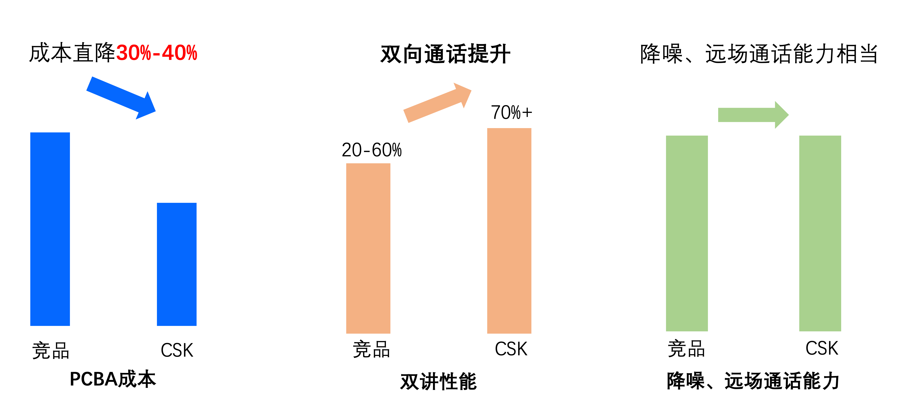
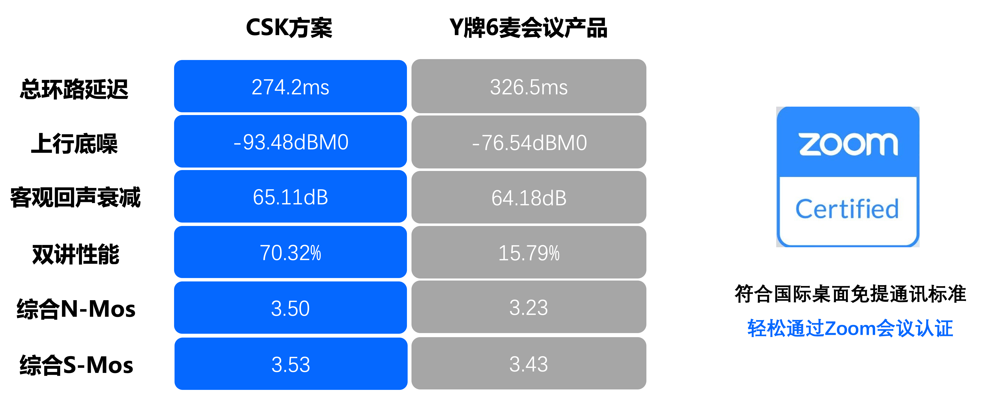
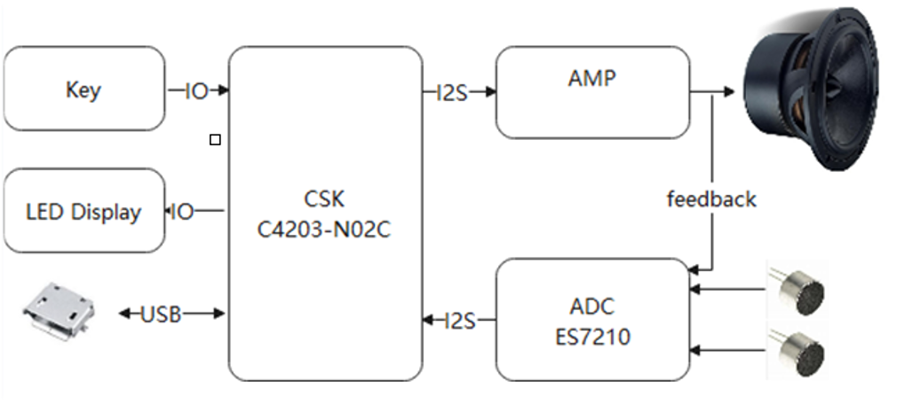
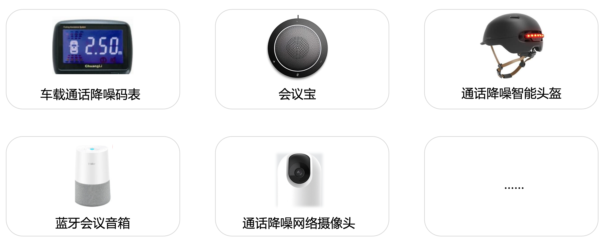

# 方案介绍

> 通过本篇文章你将了解到：
>
> - 聆思通话降噪方案说明和方案优势
> - 通话降噪方案基本原理和使用场景
> - 聆思通话降噪方案的落地案例

### 聆思通话降噪方案介绍

近年来，随着云计算、人工智能、5G等多项先进技术的成熟应用，会议终端市场正在经历由传统电话会议向云会议高速变革的蜕变期，会议终端市场将迎来产业格局的升级。会议终端市场规模正在高速增长，2020年市场规模达到161.5亿元。随着新冠肺炎疫情爆发，政策鼓励全民居家办公，协同办公行业随即迎来井喷式增长，在线会议、在线上课已成为人们日常生活的重要组成部分。

而 Jabra、Polycom、Anker、eMeet、联想、华为等知名品牌，都相继发布了会议通话降噪产品。

#### 方案特点

聆思CSK4002搭载先进的AI算法，致力于打造行业领先的通话降噪方案，同时拥有极致的性价比，成本直降10%-40%的情况下，获得优于竞品的面对面般真实的双向通话能力。

#### **方案对比**

性能好，成本低、集成度高的AI芯片

| **型号**   | **C4203-N02C（聆思通话降噪方案）**                           | **XVF3100**                                                  |
| ---------- | ------------------------------------------------------------ | ------------------------------------------------------------ |
| 架构       | NPU（128Gops）+MCU（250MHz）                                 | Multi-Core RISC Architecture（360MHz）                       |
| SRAM       | 1MB                                                          | 512KB                                                        |
| PSRAM      | 8M                                                           | 需外挂                                                       |
| Flash      | 8MB                                                          | 2MB                                                          |
| 麦克风阵列 | 模拟双麦                                                     | 数字4麦                                                      |
| 功耗       | 650mW                                                        | 680mW                                                        |
| 外设接口   | USB  、UART、I2C 、I2S、PWM                                  | USB  、 I2C、SPI、I2S                                        |
| 外部供电   | 3.3V/1.2V                                                    | 3.3V/2.5V/1.0V                                               |
| 算法       | VAD、Beamforming、AEC、AGC、 ANC、Far-field Voice、Full duplex、EQ | ANC、Far-field Voice、Full  duplex     Beamforming、AEC、AGC、ANC、Far-field Voice、Full  duplex |
| 封装尺寸   | QNF64，9*9mm，  0.5 mm pitch                                 | TQFP-128，16*16mm， 0.4 mm pitch                             |
| 总结       | **BOM** **成本低、效果好**                                   | **价格高、支持力度低、集成低**                               |

#### 效果表现

出众的AI算法能力

#### 方案类型

##### USB方案

- 硬件：CSK4002+ES7210+ES7148+CS83501E +模拟硅麦（兼容数字硅麦）
- 软件：标准会议降噪SDK（0开发量）
- 应用场景：即插即用的专业会议降噪设备
- 适配系统：Windows、Mac OS、Android等
- 兼容主流网络会议平台：Zoom、Teams、腾讯会议、Skype等，即插即用

##### 蓝牙方案

- 硬件：CSK4002+ES7202+模拟麦克风（兼容数字硅麦）+蓝牙soc（ATS2859、中科蓝讯、山景）
- 软件：标准通话降噪SDK，蓝牙Soc采用蓝牙音箱SDK（0开发量）
- 应用场景：专业蓝牙会议宝，蓝牙音箱免提通话功能的迭代升级
- 兼容性强：手机、PC等各类蓝牙主机连接（适用更多场景）
- 方案成熟，易于集成：针对主流蓝牙芯片，均可支持快速出货

### 落地案例

