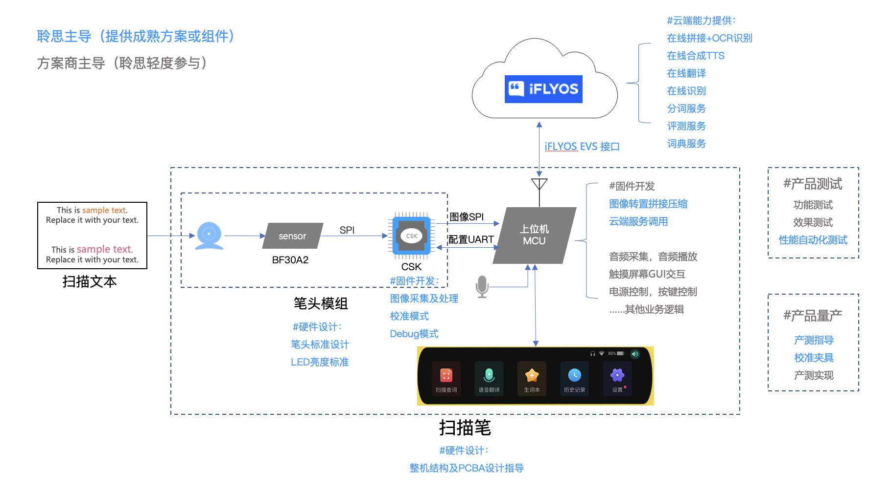

# 扫描笔Turnkey方案说明

为帮助开发者快速落地自己的扫描笔产品，聆思推出扫描笔Turnkey（一站式）解决方案；

方案包括整机（笔头模组+上位机）软硬件开发，云端能力对接、整机性能自动化测试与产测指导；从全链路解决客户在开发时遇到的疑难问题，将方案落地时间由 **6个月** 缩短至 **3个月**。

由于扫描Turnkey暂未完全开放，相关资料获取方式如下：

:::info
若您已经和我司取得合作联系，TK方案的相关资料请直接联系商务获取。

若您还未和我司取得合作联系，可在官网上提交需求说明，我们将会在1个工作日内联系您。

官网地址：https://www.listenai.com/

:::

## 一、扫描笔主机方案 

### 方案框架

上图描述了整个扫描笔的交互链路，从中可了解整个链路中各环节所起作用：

- 按压笔头开始扫描后，摄像头模组开始工作并将图片以 **66fps**（每秒传66张图）的形式传给 CSK 芯片，CSK 的作用是将传来的图片进行**裁重**，并从每次扫描的第二张图开始，计算出每张图的 **横向与纵向偏移量**；之后将裁重后的图片与偏移量信息通过 **SPI** 传给上位机；
- 上位机通过 SPI 收到 CSK 所传图片与偏移量信息后，将图片 **每5帧** 进行拼接后，通过 **EVS协议** 传至 **iFLYOS**；
- iFLYOS 根据上位机图片与偏移量信息，进行**在线拼接**，将图片传输至 **iFLYOS OCR 识别服务**；
- OCR 识别服务返回识别结果，此时 iFLYOS 再依次调用**分词**（仅支持中文）、**翻译 **与 **TTS合成** 服务；
- iFLYOS 将 **原文识别结果**、**译文结果**，**原文TTS**、**译文TTS** 返回至上位机；
- 上位机进行屏幕展示与TTS播报，本次交互结束；

**简而言之，除上位机固件底层驱动开发与界面UI设计需要开发者自行实现，其他开发项Turnkey方案均已涵盖；**项目落地时间将大幅降低；接下来将详细描述各环节中 Turnkey 提供的产物，以及开发者的使用方法。

### 硬件参考设计

针对第一次开发扫描笔的客户，本方案提供了扫描笔相关一系列硬件设计方案，如提供了《标准笔头模组参考设计》，对笔头开口宽度、摄像头夹角、摄像头距水平面高度等核心数据进行规范，开发者无需再花费时间调试，直接复用即可。

| 提供内容                   | 获取方式     |
| -------------------------- | ------------ |
| PCB参考设计           | 联系商务获取 |
| 硬件参考设计 | 联系商务获取 |
| 标准笔头模组参考设计          | 联系商务获取 |
| 核心元器件参考选型 | 联系商务获取 |

### CSK开发

Turnkey 方案提供集成了裁剪与产测校准算法的 **CSK 固件**（已集成OCR、TTS、图像拼接裁剪、校准等扫描笔相关算法） ，其中校准算法用于产测时对抠图偏移的情况进行校准；此外方案还提供 **《上位机通讯协议》**  ，规范了 CSK 与上位机通讯的 SPI 、UART 协议，帮助开发者快速完成上位机与CSK通讯，实现图片与串口指令传输。

| 提供内容                   | 获取方式     |
| -------------------------- | ------------ |
| 扫描笔CSK固件         | 联系商务获取 |
| 固件使用说明 | 联系商务获取 |
| 上位机对接协议 | 联系商务获取 |
| CSK协议调试工具   | 联系商务获取 |

### 上位机开发

#### 方案1：接入扫描笔LISA SDK，适配平台底层驱动后可运行整体方案业务

为了帮助开发者快速接入 iFLYOS，Turnkey 方案提供了基于 [LISA API](https://open.listenai.com/resource/open/doc_resource%2F%E6%89%AB%E6%8F%8F%E7%AC%94%2F%E4%B8%8A%E4%BD%8D%E6%9C%BA%2FLISA%20API%20%E5%8F%82%E8%80%83%E6%89%8B%E5%86%8CV1.3.pdf) 实现的应用层扫描笔LISA SDK。

聆思扫描笔SDK的设计宗旨为分层架构，从上往下共包括四层：

- 应用层
- SDK层
- 适配层
- 驱动层

在分层的设计基础上，统一应用和SDK接口，将适配层留出来，用于在不同芯片平台上做驱动和平台的适配，以实现在不同平台上都具有良好的移植性，既可以方便地进行SDK版本迭代，对于顶层应用而言，适配层统一了接口，底层的更新对于顶层是安全可靠的。

通过接入LISA SDK，可直接实现以下能力，大大减少开发工作量：

- 可直连 iFLYOS，无需另外实现鉴权逻辑；
- 可使用云端的 OCR、翻译、词典、语音交互等能力；
- 提供支持产测的接口，如录音质量检测；

| 提供内容                   | 获取方式     |
| -------------------------- | ------------ |
| 扫描笔上位机SDK             | 联系商务获取 |
| 《扫描笔SDK使用文档》 | 联系商务获取 |

#### 方案2：自研上位机固件，对接云端协议后可运行整体方案业务

若开发者不便集成 SDK，聆思也提供了云端扫描笔业务接口，帮助开发者实现云端在线能力。

| 文件             | 说明                                                    | 更新时间   | 操作                                                         |
| ---------------- | ------------------------------------------------------- | ---------- | ------------------------------------------------------------ |
| 隐式授权接口     | 通过隐式授权的方式，使设备通过iFLYOS云端鉴权            | 2021.08.09 | [下载](https://open.listenai.com/resource/open/doc_resource%2F%E6%89%AB%E6%8F%8F%E7%AC%94%2F%E4%B8%8A%E4%BD%8D%E6%9C%BA%2FiFLYOS%E9%9A%90%E5%BC%8F%E6%8E%88%E6%9D%83%E6%8E%A5%E5%8F%A3%E6%96%87%E6%A1%A3.pdf) |
| 扫描笔webAPI接口 | 包括请求OCR、口语评测、翻译的标准协议，以及词典接口调用 | 2021.11.22 | [查看](https://docs.listenai.com/Industrysolution/Scanning_pen/webapi) |

### 整机测试

整机开发完成后，无论是正式出货前，还是后续每次固件更新迭代，都需要进行整机性能测试，确保固件可用性；为此，聆思根据扫描笔手持滑动的特性，以**机械臂**为工具载体，输出**《扫描笔自动化测试方案》**，⼤幅提升测试效率，加快发版速度。

| 提供内容                 | 获取方式     |
| ------------------------ | ------------ |
| 《扫描笔自动化测试方案》 | 联系商务获取 |

### 产测方案

根据开发者产品需求与实际产线情况，聆思分别制定了**《产线生产测试流程指导精简版》**、**《产线生产测试流程指导完整版》**两套产测方案，建议对产测要求较高的开发者采用完整版方案，对成本要求较高者可采用精简版方案，方案文档可找商务获取；

除常规产测流程外，由于摄像头模组在组装中不可避免会出现偏差，可能导致最终抠图位置出现结构件遮挡；为避免该情况，Turnkey 提供了**自研校准夹具参考设计**，搭配 CSK 中集成的校准算法；在产测中可根据当前摄像头成像情况，自动调整抠图位置，保证采集的图片清晰，无遮挡；校准后的不良率不超过千分之一；

| 提供内容                       | 获取方式     |
| ------------------------------ | ------------ |
| 《产线生产测试流程指导精简版》 | 联系商务获取 |
| 《产线生产测试流程指导完整版》 | 联系商务获取 |
| 《自研校准夹具参考设计》       | 联系商务获取 |

:::tip

请注意，校准夹具参考设计涉及聆思专利。

:::

## 二、扫描笔外设方案 

:::info
待上线，敬请关注。

:::

