# 扫描笔方案介绍

> 本文档首先解读扫描市场，帮助初次接触该品类的读者了解市场概况。为了匹配市场需求，聆思推出具有竞争力的扫描笔方案，以三个方面着重介绍：
1. 扫描笔方案框架
2. 扫描笔方案核心能力
3. 开发量产支持（Turnkey）

## 扫描笔市场解读

### 智能教育硬件趋势明朗

政策驱动：
1. 2016年，工信部发布《智能硬件产业创新发展专项行动》
2. 2018年，教育部发布《教育信息化2.0行动计划》
3. 2021年，《双减》进一步利好智能教育硬件。

市场驱动：
1. 我国在线教育用户规模达3.42亿，学习工具更新换代速度加快。
2. 2020年科大讯飞的智能教育板块营收同比增长了70.68%；网易有道的教育硬件产品同比增长255.1%。
3. 腾讯，字节均已投入重金进入教育硬件领域，未来两年必将迎来教育硬件的飞速发展

**受政策、市场因素驱动，儿童手表、点读扫描笔、教育平板赛道竞争格局清晰，未来市场规模有望千亿，赛道增长潜力巨大。**

### K12学习工具类产品需要升级

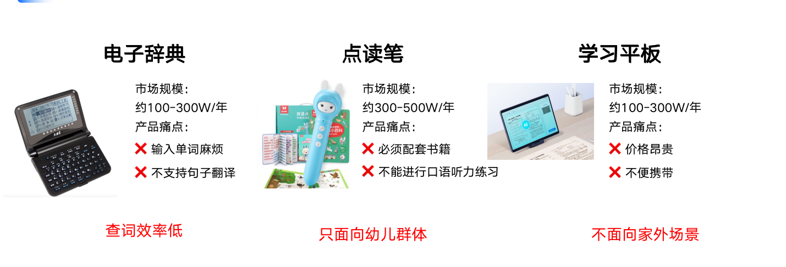

**扫描笔更利于查词、便于携带，适用于小学中高年级、大学考研、出国留学、英语学习者，用户群体广泛。**

### 描笔近三年发展迅速

**扫描笔切中家长教育和孩子学习痛点，近三年市场增速快。**

家长痛点：
1. 没时间辅导孩子的语言学习
2. 英语词汇量匮乏
3. 手机教育容易让孩子分心

孩子痛点：
1. 纸质/电子词典查词慢
2. 英语水平提高有限

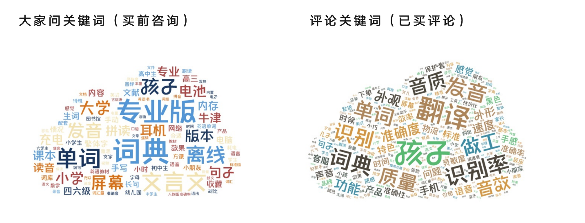

> 数据取京东、淘宝扫描笔商品评价和商品咨询。

### 市场成功案例

**有道、阿尔法蛋、科大讯飞三家抓住了趋势，用好的产品获得了大量用户认可。**

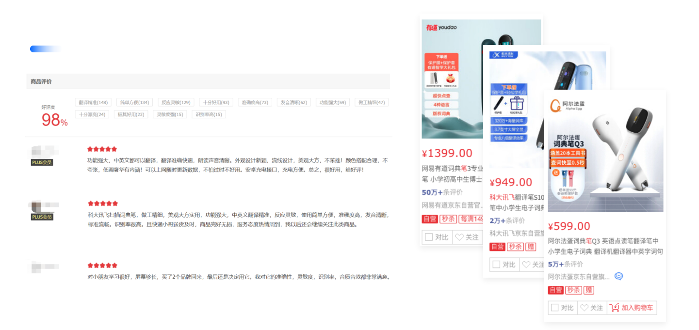

### 市场机会

市场机会仍然广阔：
1. 面向用户群体量大，三四线以下城市未被覆盖，出货量远远未到天花板。
2. 三大家已经做好一段时间的市场培育，后入者成本更低。
3. 影响用户购买扫描笔的购买决策因素多样。

## 聆思扫描笔方案框架

### 方案定位：品牌客户的入门级产品 & 白牌客户的主打型产品

**聆思扫描笔方案的硬件成本降低，效果更优，是极具性价比的扫描笔方案**

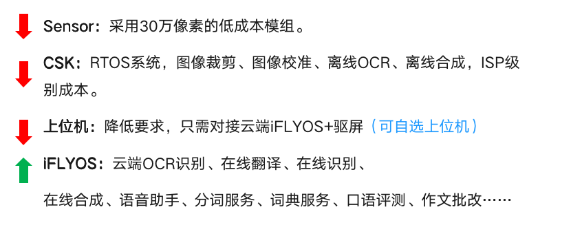

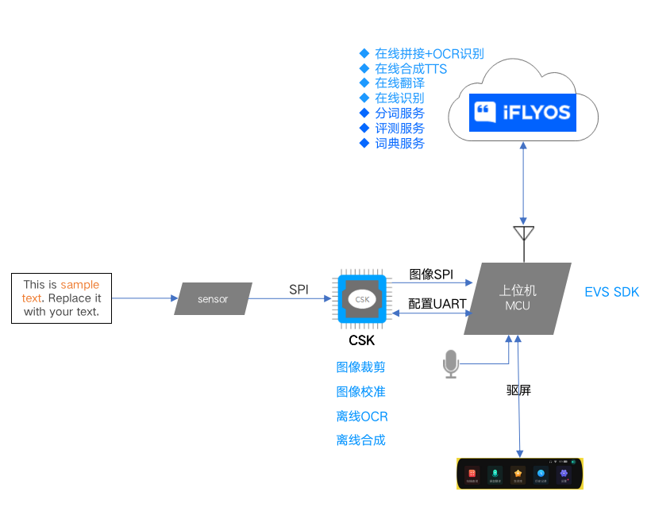

### CSK：专为AIoT而生的A.I.芯片

**CSK算力强大，与算法深度绑定，发挥最优效果。**

### iFLYOS：千万日活的AI交互平台

**云端使用iflyos，四年稳定运行，支持1000+客户，服务千万用户。**

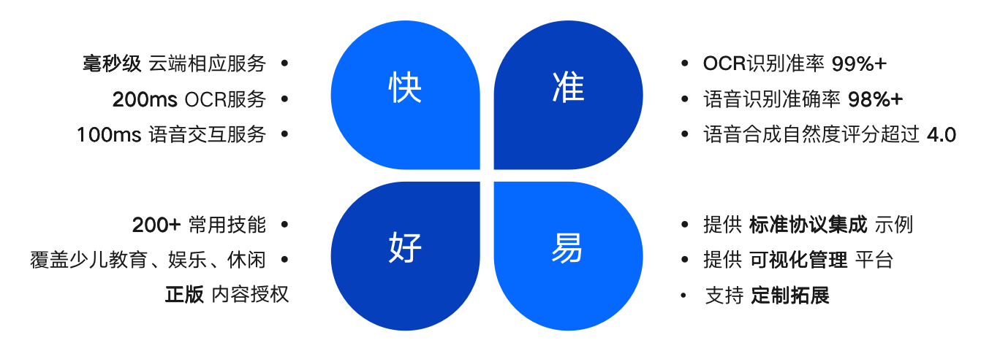

**客户自有内容，支持轻松接入：**

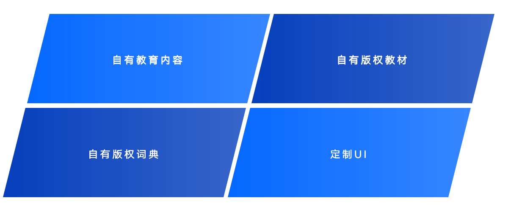

## 聆思扫描笔方案核心能力介绍

### 识别效果

**不仅于基础指标，在各种复杂场景下也能保持优秀的扫描识别能力，和友商拉开差距。**

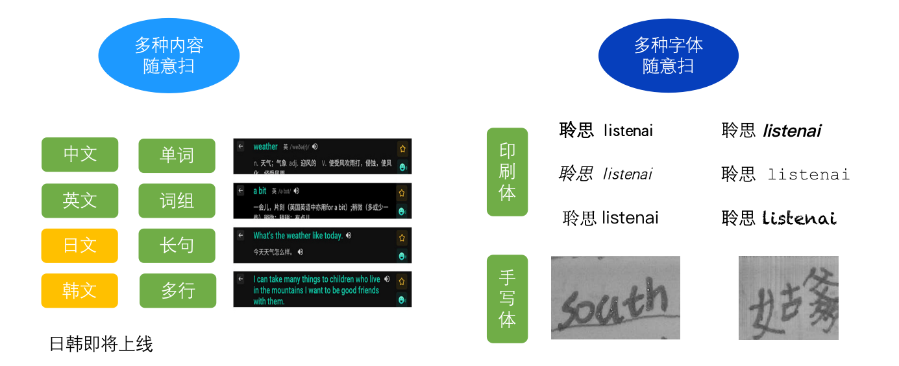

### 正版词典

**内置有道正版词典，100万+词汇量，覆盖K12中英学习需求，持续扩充中。**

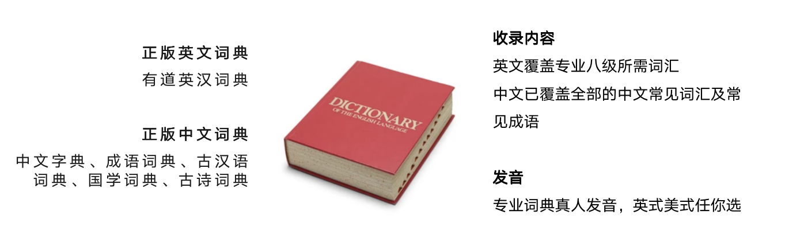

### 中英学习：翻译

1. 基于讯飞翻译机同源的中英互译能力，提供可靠稳定的引擎服务
2. 支持扫描翻译、语音翻译
3. 翻译信达雅，既是专业词典笔，也是专八翻译机

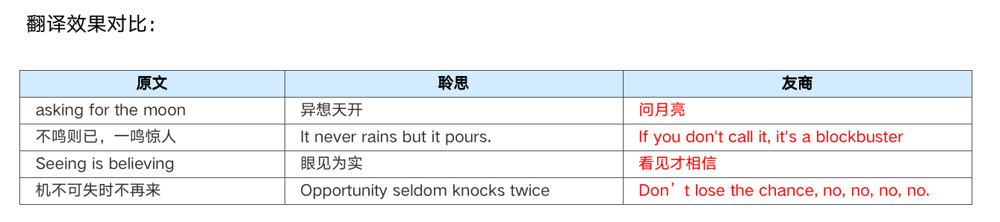

### 中英学习：评测练习

**采用中高考英语测试、普通话考试同源技术，每次听说练习都是模拟实战。**

1. 支持普通话和英文口语的字词、句、篇章等多种题型
2. 7大维度综合评分，提供准确、流畅、完整、声韵、语速等丰富维度
3. 音节粒度返回评分，准确定位发音错误
4. 国家语委鉴定，技术达到商业实用水准

### 英文学习：口语练习

**提供专业的听说训练，达到持续提高青少年口语水平的目的。**

1. 多种口语练习方式：人机场景对话、课文跟读、发音评测
2. 针对不同年龄段，提供不同题型：跟读、开放式、封闭式
3. 持续增加题目，保持学习进度。
4. 正版教育版权，保证学习质量。

### 英文学习：写作批改（即将上线）

**写作问题智能纠错，辅助提升英文写作水平**

1. 智能批改：检测拼写错误、语法错误、用词错误。提示文章亮点
2. 功能对齐市面上前三方案

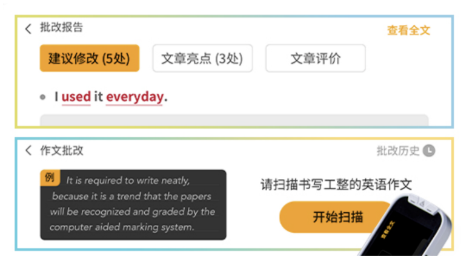

### 中文学习：文字理解

**支持10000+古诗词、文言文教学，覆盖K12学习需求。**

1. 扫单字：读音、释义、笔顺笔画（动画）
2. 扫词语：词语解释和例句。
3. 扫成语：成语解释、来源、成语故事（音频）。
4. 扫古诗：匹配全文、古诗注释、创作背景，古诗解析（音频）。
5. 扫古文：匹配全文、古文翻译、古文注释、创作背景、古文解析（音频）

### 中文学习：课文背诵（即将上线）

**支持10000+古诗词、文言文教学，覆盖K12学习需求。**

1. 教材同步，覆盖课内要求背诵的古诗词。
2. 支持多种背诵方式：自由背诵、关卡背诵。

### 语音助手

**200 + 内置技能，覆盖K12教育、娱乐领域，免费使用。**

## 开发量产支持（Turnkey）

详见[扫描笔Turnkey方案说明](/Industrysolution/Scanning_pen/Scanning_pen_turnkey)
