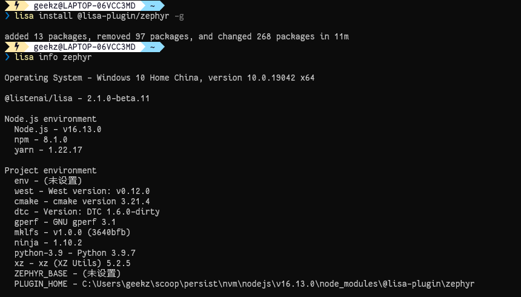

### 搭建Lisa环境

:::info

该功能需要Lisa v2.1.0 或以上版本支持，可执行lisa -v命令查看当前版本。

:::

若未安装Lisa或版本过低，请参考该[文档](/tools/LISA_LPM/installation)，进行安装升级。

### 安装Zephyr扩展包

:::info

该安装过程需要你已经基于lisa进行登录，可执行lisa login命令进行登录你的聆思账号。

:::

执行lisa命令，一键安装Zephyr扩展包，该扩展包会自动根据本机系统，搭建对应的所需环境

首次安装该扩展包时间会稍长，请耐心等待。

```shell
lisa install @lisa-plugin/zephyr -g
```

执行该命令可以查看本机安装了的lisa扩展包

```shell
lisa plugins
```

来查看下当前的zephyr环境吧~

```shell
lisa info zephyr
```



:::success

若上面步骤均顺利，恭喜你，你已经搭建好Zephyr开发的环境！

:::