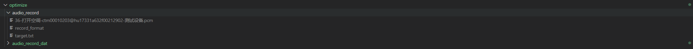
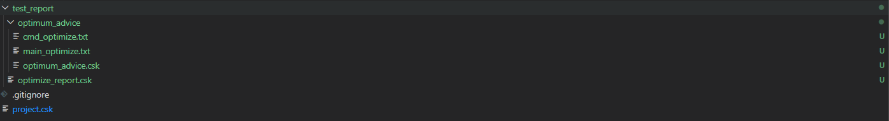

> 本文介绍如何开始使用效果调优。 
> 读完本文后，您将学到： 
> &nbsp;&nbsp;&nbsp;&nbsp;&nbsp;&nbsp;&nbsp; [√] 效果调优的意义; 
> &nbsp;&nbsp;&nbsp;&nbsp;&nbsp;&nbsp;&nbsp; [√] 如何进行效果调优; 

## 1. 效果调优的意义
> 交付关键：效果是产品的大动脉，直接影响客户交付的命脉。 
> 业绩难题：语音产品效果调优门槛高，链路长，工程化低，无全链路工具支持用户进行效果的优化。

## 2. 效果调优，LStudio能帮你做什么?
**业界首创**
> LStudio内置了**自动调优**和**阈值自助调节**两种业绩首创的效果调优方式供用户进行产品效果的提升。 

**两条腿走路** 

* **自动调优**：LStudio内置自主研发的自动寻优算法，可自动推导效果最优的阈值参数，最高可帮客户达到90分的效果水平。 

* **阈值自助调节**：LStudio提供阈值调节的可视化页面，供用户对命令词和唤醒词进行阈值调节。如果自动调优测试结果无法满足客户需求，用户可根据实际的**效果测试**结果通过**阈值自助调节**对阈值进行修改，修改完成后请点击保存，再进行**效果测试**，如此反复，直到效果满意，最后点击打包进行固件的**打包**。 

## 3. 效果调优指南
**调优前准备** 
[√] 打包工程，LStudio生成唤醒词和每个命令词的初始阈值和模型文件。 
[√] 下载冲击音频 **[ 常用工具->冲击音频 ]** 
[√] 进行实验室录音回放任务，获得录音回放音频。 

> 满足以上条件，即可进行LStudio阈值自动调优和效果测试。 

**自动调优操作指南**
> 点击自动调优后，将自动为词条寻门限，并在调优完成后，本地生成调优对比结果，可快速提高交互效果。

**3.1.1 配置录音回放音频**
> 通过外部导入回放音频或者实验室录音回放任务得到录音回放音频

**3.1.2 外部导入录音回放音频**

| 文件名 | 作用 | 备注 |  示例 |
| - | - | - | - |
| 录音回放音频 | 用于效果测试 |  命名格式: xxx.pcm  |36-打开空调-ctm00010203@hu17331a632f00212902-测试设备.pcm |
| target.txt | 录音回放音频标注文件 | 内容格式: 录音回放音频名称, 标注结果 文件格式: gbk2312 | 36-打开空调-ctm00010203@hu17331a632f00212902-测试设备,打开空调 |
| record_format | 录音回放音频格式说明 | 支持16k16bit3ch/16k16bit6ch/16k32bit6ch | 16k16bit3ch |

> 采用外部导入录音回放音频，需要按照以下步骤
* 将录音回放音频导入optimize/audio_record目录
* 将target.txt导入optimize/audio_record目录
* 将record_format文件导入optimize/audio_record目录

**3.1.3. 实验室录音回放任务导入**
> 采用实验室录音回访任务导入, 实验室录音回放任务结束之后，会将录音回放音频自动导入对应目录，用户无需手动导入。

**3.1.4. 开始自动调优**
> 点击自动调优后，即会开始自动调优

**3. 自动调优完成**
> 自动调优完成后，调优阈值、调优结果、效果测试报告会自动生成在test_report目录下

| 文件名 | 作用 | 备注 |   
| - | - | - | - |
| cmd_optimize.txt | 调优后的命令词阈值 | 用户可参考调优后的阈值，来替换config/thresholds/cmd_finaly.txt文件  |
| main_optimize.txt | 调优后的唤醒词阈值 | 用户可参考调优后的阈值，来替换config/thresholds/main_finaly.txt文件  |  |
| optimum_advice.csk | 调优报告 | 调优报告会展示自动调优前的效果测试结果和自动调优后的测试结果，以及每个词的效果提升情况 |
| optimize_report.csk | 效果测试报告| 效果测试报告会展示每个词的测试情况，包含: 识别率、未识别率、串扰率等 **查看详情**: 会展示同个词条中每条音频的识别结果 |

> 调优报告- optimum_advice.csk

> 效果测试报告- optimize_report.csk

