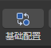
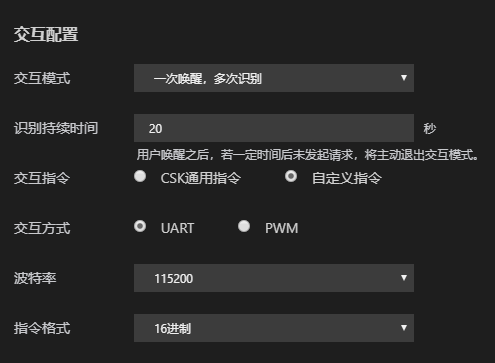

# CSK项目基础配置

:::note

本文将介绍如何进行CSK固件项目的基础配置。

阅读本文后，你将了解：

- 如何选择合适的语音芯片方案

- 如何创建语音芯片方案的固件开发项目

- 理解基础配置项，并按需求完成配置

:::

## 芯片型号和方案

### 芯片介绍

- **3001**：C3101-L01C是基于小家电语音交互场景打造的低成本、低功耗的单麦离线语音芯片。
- **3002**：C3201-L02C是基于小家电语音交互场景打造的低成本、低功耗的双麦离线语音芯片。
- **4002**：C4203-L02C是基于家居场景打造的可发挥更好语音交互效果的双麦离线语音芯片。

### 语音方案介绍

#### 离线语音方案

未联网状态下实现语音控制，在1~5米的拾音范围内，保证家居场景下对家电产品较好的控制效果。

- **3001**：代表使用C3101-L01C实现 **离线语音交互** 的项目。
- **3002**：代表使用C3201-L02C实现 **离线语音交互** 的项目。
- **4002**：代表使用C4203-L02C实现 **离线语音交互** 的项目。

#### 通话降噪方案

面向通用降噪场景提供降噪能力，可以保证常用场景下良好的拾音通话体验。

- **4002NC**：代表使用C4203-L02C实现 **通话降噪** 的项目。

#### 语音合成方案

实现无网络状态下，合成文本内容，实现播报功能。

- **4002TC**：代表使用C4203-L02C实现 **语音合成** 的项目。

## 创建一个新项目

打开LStudio，点击快捷工具栏 `新建` 按钮创建一个新项目，通过新建工程向导，你可以在这里配置您要创建的项目的基本信息。

**【工程名称】**：指新建项目的名称。

**【工程目录】**：指项目工程文件存放的本地目录。

**【芯片型号及方案】**：请根据上一节介绍选择与项目匹配的芯片和方案。

**【基础固件版本】**：原则上选择最新的基础固件版本，每次迭代都优化了历史固件中存在的种种问题。

**【版型模板】**：指可供烧录语音固件的语音方案硬件模组。目前支持选择的版型模板包括：

- 3001离线语音方案可选板型模板：
  - ASK-ES7243E：表示所使用的硬件型号为 **安顺康CSK3002纯离线标准模组** (CSK3002+ES7243E)。
  - LZ-ES7243E：表示所使用的硬件型号为 **岚正CSK3002纯离线标准模组** (CSK3002+ES7243E)。

- 3002离线语音方案可选版型模板：
  - ASK-ES7243E：表示所使用的硬件型号为 **安顺康CSK3002纯离线标准模组** (CSK3002+ES7243E)。
  - LZ-ES7243E：表示所使用的硬件型号为 **岚正CSK3002纯离线标准模组** (CSK3002+ES7243E)。
  - 聆思开发板v1.0：表示所使用的硬件型号为 **LSKit开发套件** (搭配CSK3002纯离线核心模组，CSK3002+ES7243E)。

- 4002离线语音方案可选版型模板：
  - 聆思离在线公版1.0 : 表示所使用的硬件型号为 **聆思第一代EVB离在线公板**（绿色）。
  - 聆思离在线公版2.0 : 表示所使用的硬件型号为 **聆思第二代EVB离在线公板**（黑色）。
  - ES7210：表示所使用的硬件型号为 **CSK4002纯离线标准模组** (CSK4002 + ES7210)。
  - 聆思开发板v1.0：表示所使用的硬件型号为 **LSKit开发套件** (搭配CSK4002纯离线核心模组)。
  - 聆思公板：表示所使用的硬件型号为 **奥克斯纯离线模组** (CSK4002 + NAU85L40)。
- 4002NC通话降噪方案可选板型模板：
  - 聆思公板NC：表示所使用的硬件型号为 **奥克斯纯离线模组** （CSK4002+NAU85L40）。
  - HK-ES7210-NC：表示所使用的硬件型号为 **海克莱特降噪模组的硬件型号**（CSK4002+ES7210）。

当你决定好了以上选项后，请点击 **确认** 完成固件项目的创建。

## 打开基础配置

以离线语音项目为例，假设你已经成功创建了一个离线语音项目，你可以通过LStudio方便地对项目进行基本配置。LStudio将一些高频的操作放置到窗口的 **菜单栏** 下，我们将包含这些快捷操作的部分命名为 **快捷按键栏**。

点击就可以打开项目的基础配置项。

你也可以点击项目左侧工程树 **config/gui/base.csk** ，打开项目的基础配置项。

:::tip

如果没有刷出项目基础配置项的可视化页面，尝试多点击几次。

:::

## 开始基础配置

### 基础固件配置

- 【芯片型号及方案】：显示创建项目时选择的芯片型号及方案。
- 【基础固件版本】：显示创建项目时选择的基础固件版本。
- 【版型模板】：显示创建项目时选择的版型模板。
- 【降噪场景】：默认选择通用场景，适合客卧、办公室等常见场景，环境噪音主要为家居常噪，覆盖家居环境中的家电噪声，电视噪声，人员走动等情况下的降噪需求。

### 麦克风配置

- 【麦克风类型】：支持选择模拟麦克风和数字麦克风。简单来说，数字麦克风的抗干扰能力更强。请按照实际情况进行选择。
- 【麦克风间距】：两个麦克风之间的距离，我们建议麦克风间距孔是35mm或120mm，这样效果最优。若你的麦克风间距不能完全匹配，填写和你麦克风间距最近的数字。

### 发音人配置

- 【发音人】：可以选择不同性别、不同风格、不同语言的发音人。目前支持的语言或方言包括：普通话、英语、日语、粤语。我们退加你使用 **叶子**，这是目前自然度最好的发音人。
- 【音量】：即发音人音量，默认选择最大，数字越大，音量越大。
- 【语速】：即发音人语速，默认语速适中，数字越大，语速越快。

:::tip

可输入自定义文本，并点击 **试听** 按钮，选择你最可心的发音人配置。

:::

### 交互配置

- 【交互模式】：配置你想要的交互模式。目前支持的交互模式包括：
  - 一次唤醒，一次识别：唤醒设备后仅能进行一次交互，如果需要发起第二轮请求，需再次唤醒设备。例如：
    - “你好哈利”-“打开空调”
    - “你好哈利”-“二十六度”
  - 一次唤醒，多次识别：唤醒设备后，在规定的时间内可以进行多次交互，无需再次唤醒设备。例如：
    - “你好哈利”-“打开空调”
    - “二十六度”
    - “打开制冷”

- 【识别持续时间】：唤醒设备后保持识别状态的时间。如设备在规定的时间内未收到有效的语音请求，设备会退出识别状态。如需再次发起请求，请重新唤醒。
- 【交互指令】：语音硬件模组对外发送指令。指令包括：
  - CSK通用指令：聆思智能制定的标准指令，通过 **UART** 进行输出。需要在上位机适配聆思智能CSK芯片发送的指令。指令详情请参考：*这里是一条链接*。
  - 自定义指令：在上位机已支持特定指令的情况下，指定聆思智能CSK芯片输出对应指令，上位机无需进行二次开发。
- 【交互方式】：目前自定义指令支持 **UART** 和 **PWM** 两种传输方式。
  - **UART** 指令可选择发送的波特率和串口指令格式。请根据 **UART** 对接的芯片情况进行配置选择。
  - **PWM** 指令可选择发送的频率、占空比和传输次数。请根据`PWM`对接的芯片情况进行配置选择。

