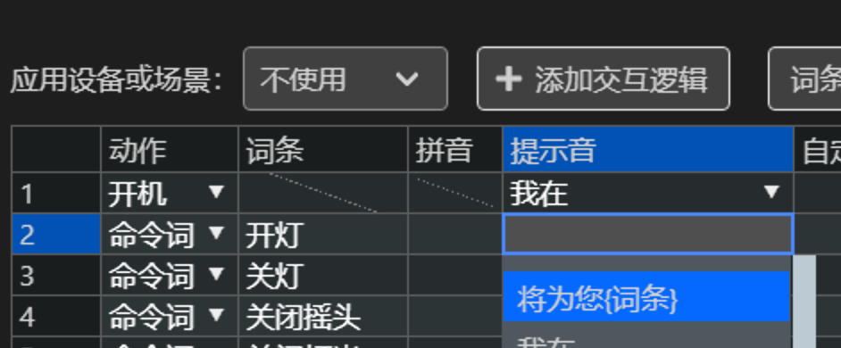

:::note 本篇介绍CSK项目的语音交互配置。
读完本文后，你将学习到：

- 怎么设计用户体验好的语音交互。

- 如何在LStudio中定义语音交互。

:::

## 1 语音交互设计原则

### 1.1 唤醒词设计

唤醒词相当于设备的名字，当用户与设备交互时，选唤醒设备，再说出对应指令。

在设计唤醒词时，我们建议在保障品牌特性的前提下，遵循以下原则：
1. 一般建议4~6个字，4个字最佳。唤醒词过短容易导致误唤醒，过长不利于用户记忆。
2. 为了避免过高的误唤醒率，唤醒词不宜过多，最好不要超过3个。
3. 尽量避免常用词，选用不常说的词作为唤醒词，能有效降低甚至避免误唤醒。如：小姐姐，下一首，继续播放等；
4. 避免选择重复的字，如：AABB（天天宝宝），ABAB（小美小美），AABC（天天宝贝）的格式。
5. 避免连音或近音，如：“语音语义”，“叮咚叮咚”。
6. 建议选择音节较长的字，不要选择音节很短的字，避免无声母的字，如：“安”字。
7. 选取的字要发音清晰、能量响度高、开口度大，最好带有爆破音，如：“胖”字、“开”字等。选取能量高的字，更易唤醒。
    - 声母推荐选择包含爆破音声母的音节，如 p、b、t、d、k、g 等，可以提高发音能量。
    - 韵母推荐选择大口型、开口音的韵母，如 a、ai、an、ian、ao、ang，避免 e、i、en、in 等。如：“开”、“嵌”、“跑”等字质量比较好，“妮”、“了”、“敏”、“星”等字质量比较差。
    - 韵母是复韵母，如 ai、ei、ao、ou、ia、ie、ua、uo、üe、iao、iou、uai、uei 等，这样的字质量较好。

优秀唤醒词示例：“凯越在线”，“小美空调”，“小唱同学”

:::info 说明
不建议使用的唤醒词，不是不能用。但是效果较差，且效果优化的投入产出比低。
:::

### 1.2 命令词设计

在设计命令词时，从用户体验角度考虑，请优先考虑以下原则：
1. 符合用户的语言习惯，命令词内容具体直接，符合用户常用的说法。
2. 尽量避免泛化。因为离线命令词受数量限制，无法做到极致泛化。若命令词做了部分泛化，用户无法记住泛化规则，容易出现未被覆盖的说法，从而造成操作不成功。若一定需要泛化，请保证能够向用户清晰传达便于记忆的泛化规则。
3. 对于相反的操作，建议选择句式和说法符合用户直觉的反义词。如“调高温度”，对应“调低温度”，而不要选择“降低温度”或“减小温度”。
4. 尽量避免出现子串。如：“十六度”和“二十六度”，词之间的字存在包含关系，在识别时就容易互相串扰，可以改成“调到十六度”和“调到二十六度”进行优化。

除以上原则外，当一个操作有多个命令词时，我们建议用以下原则进行择优选择
1. 优先选择声韵母区分度大的词。
2. 尽量避免选择无声母的词，如“二”。
3. 尽量避免词中汉字声调都是`第一声`和`第二声`；
4. 尽量避免以数字开头
5. 尽量避免读音不明的词，如“ECO模式”，用户无法准确知道应该按照单词读法还是字母读法。
6. 字数不宜过长，建议在3-6个字之间，最好是4个字。

### 1.3 回复语设计

在设计回复语时，提示语需达到以下目的（按优先级排序）：
1. 让用户明确知道设备确实听清楚了用户说的话。
2. 让用户清晰地知晓设备当前的状态或刚才所做的操作。
3. 让用户在交互过程中加深对命令词的记忆。
4. 让用户感受到智能和人情味，向用户传达品牌调性。

所以我们建议以下原则：
1. 回复语设计要自然，符合用户对话习惯，推荐适当带些情绪温度。如：应答语“睡眠已开”和“已打开睡眠功能，请注意盖被子，小心着凉”，后者更能体现人情味。
2. 回复语不要过长，避免引起用户方案。一般我们建议提示语不要超过20个字。
3. 回复语与命令词要一一对应，增强用户记忆点和反馈体验。如：命令“打开睡眠模式”，回复“已打开静音模式”，即使功能上睡眠模式和静音模式一致，但这样的应答语会造成用户误解。

## 2 LStudio操作

### 2.1 交互模板

聆思基于在语音交互领域的经验，将常用品类的交互模板进行深度定制，并免费开放。

你可以直接选择模板进行使用，也可以在模板的基础上，进行自定义操作。

具体操作如下图

:::info 说明
交互模板的效果会持续升级，模板覆盖品类也会持续增加。
:::

### 2.2 自定义词条

1. 新增词条时，你可以在【词条】列中 输入、粘贴词条；
2. 工具可自动识别拼音；若拼音有误，可自行修改（模型训练时，以拼音为准）；
3. 拼音格式：`da3 kai1 kong1 tiao2`，其中字母为拼音，数字为音调（0代表轻声）；
4. 如果你不需要部分词条，可以点击进行删除；

:::tip 快捷操作
可以在本地维护一个excel表，分为【动作】【词条】【拼音】【提示音】【自定义串口指令】5列。其中【拼音】列可以留空。填写完成后，全选复制，并在`interact.csk`中选中第一行第一列的单元格，`Ctrl+V`，即可完成词条和提示音的填写。
:::

:::caution 注意
1. 若你的词表还未确定，我们建议尽量从聆思提供的深定制模板中选择词条。
2. 在词条检测后，我们将会自动为你生成拼音，请特别关注多音字提示中的拼音分解是否有误，若有误，请自行手动更改。
:::

### 2.3 词条检测

填写完成后，点击【词条检测】可对命令词进行检测。检测结果说明:

error（不能使用）
| 检测结果 | 修改建议 |
| -- | -- |
| 仅支持3-5个中文字 | 唤醒词不得过长或过短。|
| 唤醒词拼音长度不得超过33字节 | 请缩短词条字数。|
| 评分较低不适合当唤醒词 | 请更换唤醒词。|
| 只支持中文 | 若词条中有数字，请转为中文说法；若词条中有字母或英文，请转为相近读音的中文。|
| 不能超过8个字 | 命令词词条字数不能超过8个字。|
| 拼音+音调+空格的长度不能超过33个字节 | 请缩短词条字数。|

warning（不建议使用）
| 检测结果 | 修改建议 |
| -- | -- |
| 避免首字是数字 | 容易产生串扰，请尽量在数字前增加其他说法。|
| 避免出现子串 | 容易产生串扰，请尽量在子串前后增加其他说法。|
|  存在多音字 | 请再次检查拼音是否有误。|

### 2.4 自定义回复语

#### 2.4.1 语音合成TTS回复语

1. 支持发音人、音量、语速的配置；
2. 点击提示音文本后的【播放按钮】，可进行试听;
3. 合成文本支持中英文、数字、标点符号；
4. 若合成读法有误，可使用`合成标记`对合成音频进行干预；

:::tip 快捷操作
提示音中支持“{词条}”的用户，你可以在下拉列表中选择“将为您{词条}”，或输出“xxxx{词条}xxx”，此时系统会自动为您合成包含词条的提示音。
如：“现在为您{词条}”：
- 当词条是“开灯”时，TTS为“现在为您开灯”
- 当词条是“打开风扇”时，TTS为“现在为您打开风扇”

:::

:::info 常用合成标记
- [h*]：指定单词发音方式。
	- [h1]happy —— 指定为字母发音
	- [h2]happy —— 指定为单词发音
- [n*]：指定数字发音方式。
	- [n1]1200 —— 指定为号码发音：一二零零
	- [n2]1200 —— 指定为数值发音：一千二百
- [=*]：为标记前的一个汉字指定拼音。数字代表音调，支持1~5，其中5为轻声
	- 调[=tiao2] —— 发音为“调整”的“调”
	- 调[=diao4] —— 发音为“音调”的“调”
:::

#### 2.4.2 音效提示音

点击【deps\tones_include】，将本地音频文件拖入该条目下，即完成导入。成功导入后，该文件会出现在`interact.csk`提示音选项中，也会出现在`tones.csk`的代码模式中。

:::caution 音频格式
仅支持16k，mp3格式的音频
:::