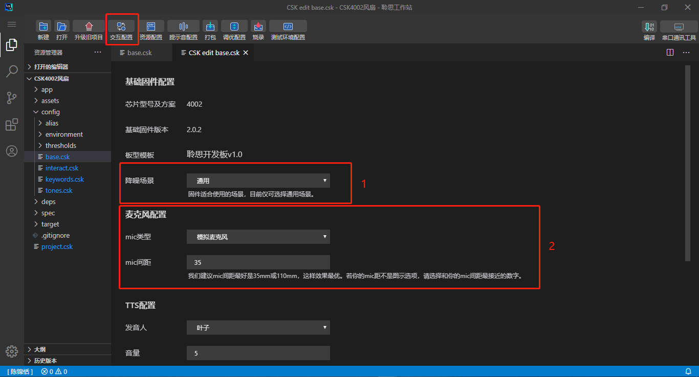
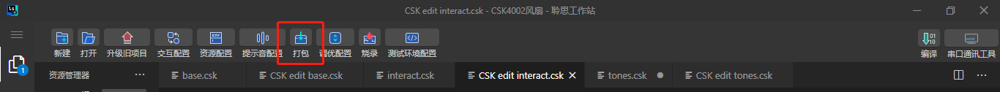
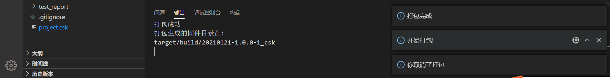
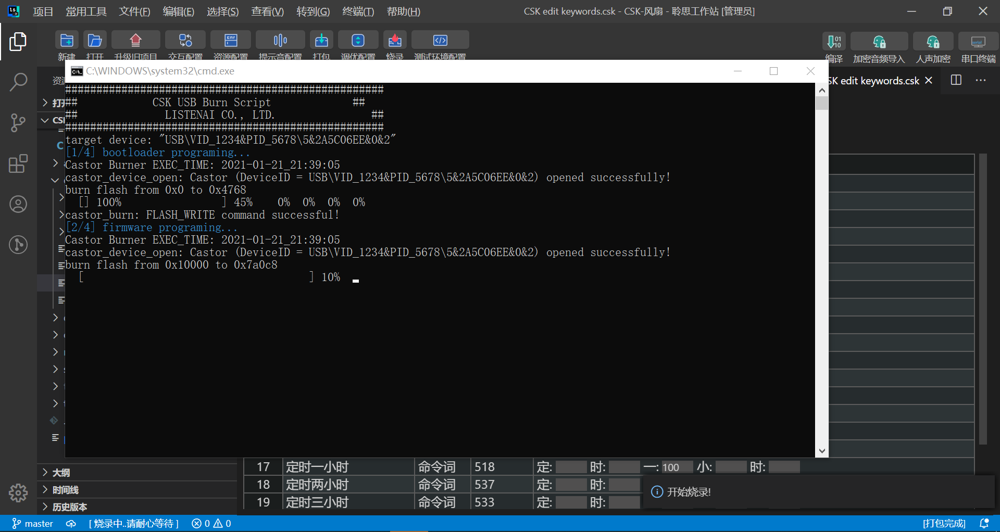
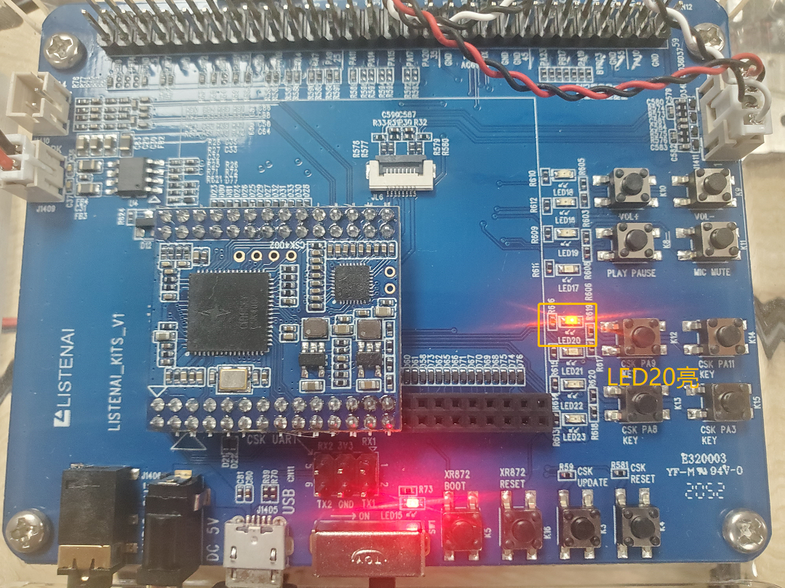
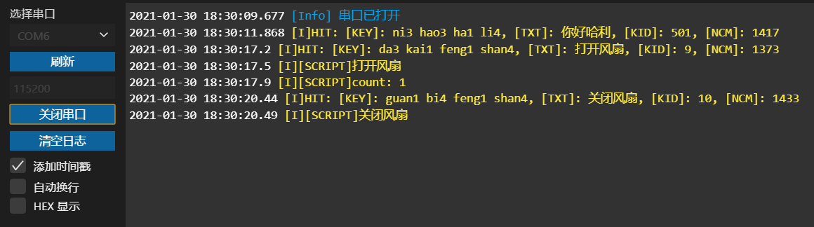

---

id: getting_start
title: CSK项目开发快速入门
slug: /getting_start

---


> 通过本篇你将通过一系列具体的示例操作了解到：
1. 如何完成 LStuido 环境配置；
2. 如何使用 LStuido 创建项目并完成简单的固件配置；
3. 如何使用 LStuido 把固件烧录到 LSKits，得到一个小风扇语音交互 demo；
4. 如何使用简洁语法实现：在获取回调后，定义 GPIO 控制外围器件。

## 1. 做好准备

### 1.1 下载安装 LStudio

点击[此处](https://castor.iflyos.cn/castor/v3/lstudio/download)下载 LStudio 安装包，依次点击 “下一步” 直至安装完成。

### 1.2 登录


使用聆思账号密码登录，如果没有账号请先注册。

### 1.3 安装驱动


点击左上方常用工具，安装烧录驱动。

### 1.4 安装vc++环境依赖

请下载 [vc++依赖](https://cdn.iflyos.cn/docs/lstudio_extension.zip)并依次安装。


### 1.5 安装git

如果当前电脑未安装 git，在进入 LStudio 界面后，请按照右下角提示安装 git 客户端，如下图所示：


使用默认选项一路点击 NEXT 直至安装完成。
为确保 git 安装完成，重启 LStduio 后在控制台输入 `git --version` ，显示以下信息表示安装成功。


### 1.6 获取 LSKits 开发板

你需要拿到一个聆思官方的开发板，请关注聆思科技公众号（LISTENAI）或联系聆思商务团队获取。


## 2. 制作第一个 CSK 固件

你将学会动手创建一个 CSK 固件，请按照文档说明逐步操作。

### 2.1 创建项目


创建一个新的项目，流程如下：
1. 输入工程名称：CSK4002风扇
2. 选择工程目录。
3. 选择芯片型号：4002。
4. 选择基础固件版本：选择最新版，目前是3.0.2。
5. 选择板型模板：聆思开发板V1.0。

:::tip

工程名称不可包含空格或其他特殊符号。

:::

### 2.2 基础配置

接下来，点击工具栏左上角的“基础配置”来选择你想使用的配置，如下图。交互指令选择“自定义指令”，其它暂时使用默认配置。当然在这里你也可以通过修改该页面下的“TTS配置”和“交互配置”等实现个性化效果。



### 2.3 资源配置

基础配置信息配置好了，为了能与之交互，你需要添加自定义唤醒词和命令词。为方便开发者快速实现产品开发，我们提供了近20个常用设备场景模板，品类涵盖冰箱、空调和风扇等（持续丰富中）。请直接选择`小风扇`模板然后点击“保存”。如下图所示：


### 2.4 固件打包

你已完成了一个固件应该配置的所有内容，接下来需要对固件进行打包。



1. 点击 LStudio 上方工具栏的固件打包。


2. 输入固件打包版本号。




3. 等待固件打包完成（3~5min）。

:::tip

打包过程中请不要关闭 LStudio。

:::

### 2.5 固件烧录

最后，你需要将打包好的固件烧录进 LSKits。你可以先查看演示视频：[聆思开发板LSKits固件烧录说明](https://www.bilibili.com/video/BV18T4y1P7Pm)。


1. 使用usb数据线连接 LSKits 与电脑，关闭 LSKits 开关（左拨）；
2. 按住LSKits上的`update`键，再打开开关（右拨），**先不要松开 update 键**；


2. 点击`LStudio-工具栏-烧录`，页面提示进入烧录模式后，可以松开update键；



3. 等待固件烧录（20s），烧录完成后会显示`PASS`并关闭烧录界面；

4. 烧录完成后，按击 LSKits 的`reset`键，新烧录的固件即可生效。


:::tip 若烧录失败，请检查：
1. 是否已准确执行上方烧录流程；
2. 是否已按1.4步安装相关驱动；
3. 请确保 LSKits 上的芯片型号是4002；
4. 烧录或者重启的时候，需要把串口拔掉。硬件上串口电源会倒灌，可能引起无法重启或者烧录；
5. 若连续烧录失败，请联系FAE/提交工单寻求帮助。
:::

### 2.6 “你好哈利！”

恭喜你得到了第一个固件。现在你可以使用唤醒词`你好哈利`和`交互配置中的命令词`与 LSKits 进行交互了。

你也在 LStudio 集成的串口终端中查看语音交互过程中的日志：


## 3. 点亮 LED 灯

相信你已经能够体验到风扇 demo 的语音交互了，但好像还不能真正实现风扇控制。在项目开发中，我们需要根据被控设备芯片通信协议（如 UART/I2S/PWM 等）进行开发。为演示与被控设备通信，我们通过点亮 LSKits 上一个 LED 灯来展示通信方式的实现。

### 3.1 注册回调事件并配置引脚

> 在这一小节中，你将实现在用户主程序中注册系统回调，在回调中完成意图发送。

在项目目录找到 `app/app_main.c` 文件:

1. 在识别回调`cb_esr_recognition`中使用`csk_script_handle_intent`发送当前的意图给 `ScriptEngine` 处理;

```c
static void
cb_esr_recognition(keyword_attrs_t *key_attrs)
{
	CLOGD("[APP]ESR Recognition: kid=%d", key_attrs->kid);

	// 如需在 ScriptEngine 中处理指令，取消下面这一行的注释
	csk_script_handle_intent(key_attrs->txt);
}
```
2. 在`app_main`中
   
* 使用`csk_handler_register`注册唤醒回调;
   
* 使用`csk_handler_register`注册识别回调；

* 使用`pinmux_config`配置芯片管脚的功能; 
   * 配置芯片管脚`PIN42`为GPIO功能，输出方向;
  
```c
void
app_main(void)
{
	CLOGD("[APP]Hello world");

	// 唤醒和命令词相关回调，取消注释使用
	csk_handler_register(CSK_EVENT_WAKE_UP, cb_wake_up);
	csk_handler_register(CSK_EVENT_ESR_RECOGNITION, cb_esr_recognition);
	
	// 如使用 PIN42的GPIO功能来驱动LED20，取消下面这一行的注释
	pinmux_config(42, 0);  // LED20
}
```


### 3.2 驱动GPIO进行LED控制

> 在这一小节中，你将使用轻量级语法，在脚本中捕获意图, 并进行GPIO的控制。

**捕获命令词 `打开风扇` 后，点亮 LED20**

你可以在 `app/scripts/intents.rb` 定义业务逻辑。先修改第一个示例方法：
1. 把 `on_intent` 后的命令词修改为需要捕获的`打开风扇`；
2. 同步修改日志打印内容 `EngineCore.logger.info "打开风扇"`;
3. 取消 `IO.set 42, :low` 的注释，实现点亮 LED20；

```js
on_intent "打开风扇" do
  EngineCore.logger.info "打开风扇"
  
  # 点亮 LED20
  IO.set 42, :low
end
```

**捕获命令词 `关闭风扇` 后，熄灭 LED20**

然后修改第二个示例方法，定义捕获`关闭风扇`后的交互。

```js
on_intent "关闭风扇" do
  EngineCore.logger.info "关闭风扇"

  # 熄灭 LED20
  IO.set 42, :high
end
```

你可以在LStudio 使用轻量级语法实现业务配置，可以查看[CSK SDK使用示例](https://open.listenai.com/csk_sdk_demo) 。

还有更详尽的API文档，你可以查看[EngineCore API](https://open.listenai.com/csksdk/csk4002/mruby/table_of_contents.html)。

### 3.3 体验新的效果

在完成以上代码修改后，重新依次进行`固件编译`、`固件打包`、`固件烧录`。

烧录完成后重启开发套件，当命中`打开风扇`后，LED20 灯光会同步亮起；当命中`关闭风扇`后，LED20 灯光会同步熄灭。



你也可以在串口终端查看到通过  `ScriptEngine` 定义出的日志，如 `[I][SCRIPT]打开风扇 `。




## 了解更多

你可以通过以下材料进一步了解 LSKits：

- [LSKits硬件使用指导手册.pdf](https://open.listenai.com/resource/open/doc_resource%2F%E7%A1%AC%E4%BB%B6%E8%AE%BE%E8%AE%A1%E6%8C%87%E5%8D%97%2F%E5%8E%9F%E7%90%86%E5%9B%BE%26PCB%E8%AE%BE%E8%AE%A1%E5%8F%82%E8%80%83%2FLSKits%E7%A1%AC%E4%BB%B6%E4%BD%BF%E7%94%A8%E6%8C%87%E5%AF%BC%E6%89%8B%E5%86%8C.pdf)

- [下载 LSKits 参考设计](https://open.listenai.com/resource/open/doc_resource%2F%E7%A1%AC%E4%BB%B6%E8%AE%BE%E8%AE%A1%E6%8C%87%E5%8D%97%2F%E5%8E%9F%E7%90%86%E5%9B%BE%26PCB%E8%AE%BE%E8%AE%A1%E5%8F%82%E8%80%83%2FLSKits%E5%8F%82%E8%80%83%E8%AE%BE%E8%AE%A1.zip)

- [LSKits BOM.zip](https://open.listenai.com/resource/open/doc_resource%2F%E7%A1%AC%E4%BB%B6%E8%AE%BE%E8%AE%A1%E6%8C%87%E5%8D%97%2F%E5%8E%9F%E7%90%86%E5%9B%BE%26PCB%E8%AE%BE%E8%AE%A1%E5%8F%82%E8%80%83%2FLSKits%20BOM.zip)


为了快速定制扩展语音项目，你可能对以下内容也感兴趣：

- [自定义词表与回复语](http://open.listenai.com/vui) 

- [如何使用LStudio实现自定义业务开发](http://open.listenai.com/csk_sdk_demo) 

- [如何使用LStudio修改基础配置](https://open.listenai.com/guides/firmware/base_config) 

在项目开发过程中如果需要帮助，可以通过工单系统向我们获取技术支持：

- [工单系统](https://open.listenai.com/cloud_project) 


