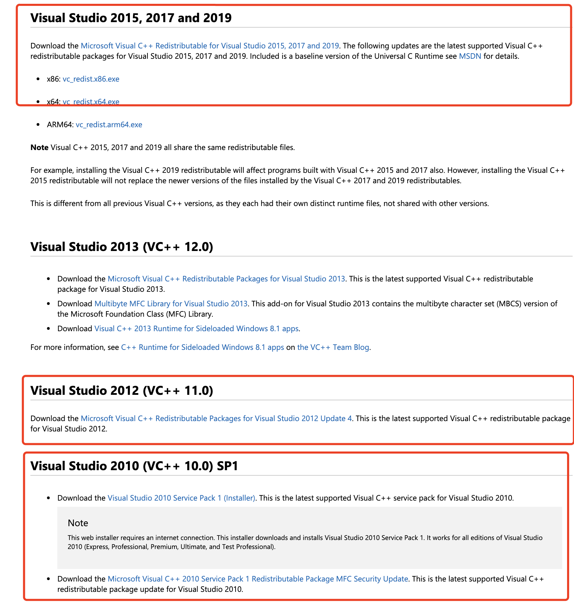
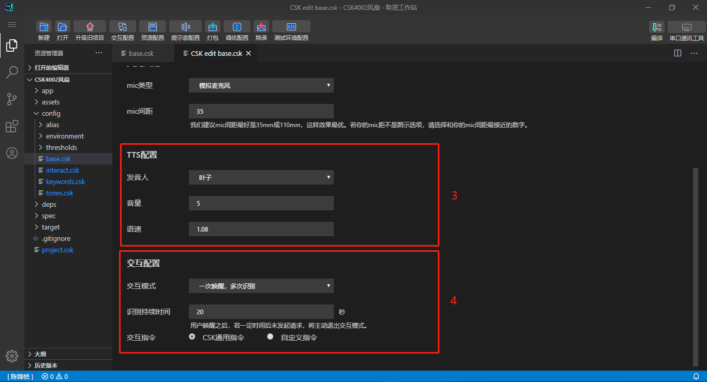
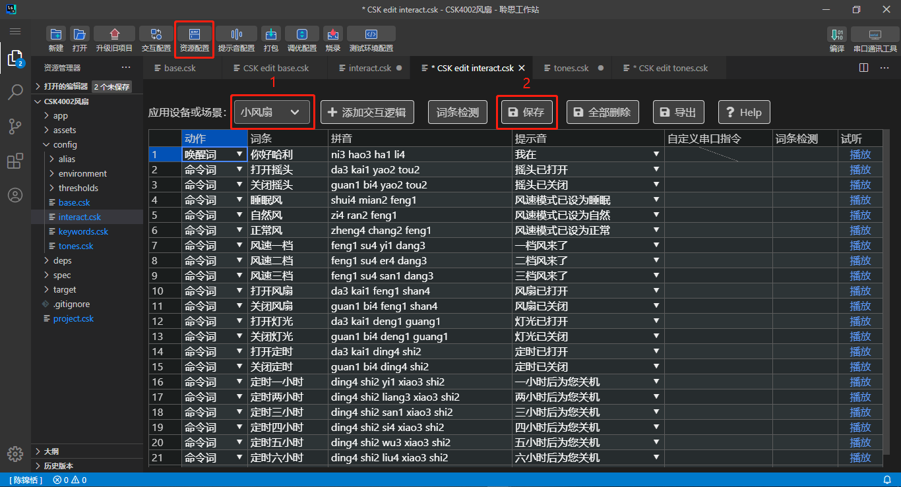
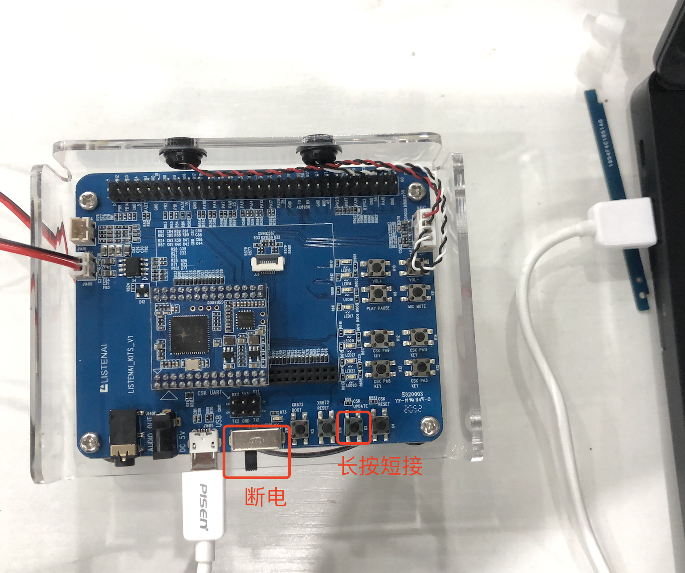

---

id: getting_start
title: CSK项目开发快速入门
slug: /getting_start

---

## CSK项目快速开发入门

> 本篇介绍你如何快速上手使用集成开发环境（LStudio）创建一个项目，并在开发板（LSKits）上运行起来，完成你的第一个CSK项目。
看完本篇你将了解到：
> 1. 如何使用LStuido创建CSK项目，并进行简单的配置。
> 2. 如何使用LStuido烧录固件，体验你的第一个CSK语音交互DEMO。

### 1. 做好准备

#### 1.1 下载安装LStudio

- 下载地址：https://castor.iflyos.cn/castor/v3/lstudio/download

#### 1.2 登录

- 使用聆思账号密码登录。

#### 1.3 依赖

点击常用工具

<!-- - 安装地址：https://git-scm.com/downloads

#### 1.4 安装烧录驱动

- 点击左上方常用工具，安装烧录驱动。

#### 1.5 安装vc++

- 安装地址：https://support.microsoft.com/en-in/help/2977003/the-latest-supported-visual-c-downloads
- 安装vc++2010、2012、2015（x86、x64）。
 -->

#### 1.5 获取一套聆思开发板（LSKits）
- 你需要拿到一个聆思官方的开发板，关注聆思公众号进行购买。
**二维码**

---

### 2. 开发你的第一个语音项目

你将马上学会创建一个风扇语音交互项目，阅读该部分的最佳方法是一步步跟着操作，所有这些步骤都是可视化配置的，不需要额外编写代码或者其他操作。

#### 2.1 创建项目

创建一个新的项目，由于当前使用聆思开发板进行开发，请按照以下配置即可：
1. 输入工程名称：CSK4002风扇
2. 选择工程存放目录。
3. 选择芯片型号：4002。
4. 选择最新基础固件版本：3.0.0。
5. 选择板型模板：聆思开发板V1.0。

:::tip

工程名称不可包含空格或其他特殊符号。

:::

#### 2.2 交互配置

在LStudio上方工具栏选择项目基础配置，流程如下：
1. 降噪场景选择：通用。
2. 麦克风类型选择：模拟麦克风，mic间距35。
3. 发音人选择：叶子，音量5，语速1.08。
4. 交互模式选择：一次唤醒，多次识别，识别持续时间20s，使用CSK通用指令。

:::tip
麦克风请根据实际硬件选型进行配置，聆思开发板（LSKits）默认推荐使用模拟麦克风。
<!-- 2. 若需要使用自定义串口协议，可以在交互指令处选择自定义指令。 -->
:::

#### 2.3 资源配置

在LStudio上方工具栏选择资源配置，流程如下：
1. 选择风扇模板。
2. 保存。

#### 2.4 固件打包

你已完成了一个固件应该配置的所有内容，接下来需要对固件进行打包。

1. 点击LStudio上方工具栏的固件打包。

2. 输入固件打包版本号。

3. 等待固件打包完成（3~5min）。

:::tip

打包过程中请不要关闭LStudio。

:::

#### 2.5 固件烧录

最后一步，将固件烧录进LSKits即可体验。

1. 使用usb连接聆思开发板与电脑
1. 聆思开发板关机，按住update键，再开机，松开update键，进入烧录模式

2. 点击工具栏-烧录。

3. 等待固件烧录（1~2min），完成后将会显示PASS。

:::tip

若烧录失败，请检查：
1. 是否已准确执行上方烧录流程。
2. 是否已按1.4步安装相关驱动。
3. 请确保聆思开发板上的芯片是4002。
4. 若连续烧录失败，请联系FAE/提交工单寻求帮助。

:::

#### 2.6 唤醒聆思开发板

恭喜！你完成了第一个固件的制作，现在你可以使用唤醒词“你好哈利”和聆思开发板进行交互了。

---

###

### 3. 学习更多开发知识

除了快速制作语音项目，你还可以：
- 开始自定义的你项目的唤醒词、命令词和回复语：http://open.listenai.com/lisa_guide
- 更加完整了解CSK项目的每一个基础配置项：http://open.listenai.com/lisa_guide
- 修改硬件配置：http://open.listenai.com/lisa_guide
- 自定义业务逻辑：http://open.listenai.com/lisa_guide

更多的内容，你可以在 http://open.listenai.com 上进行了解。

在项目开发过程中如果需要帮助，可以随时查看开发指南：http://open.listenai.com/guides_index

你也可以提交工单，寻求我们的帮助：https://cloud.listenai.com/dashboard/projects
