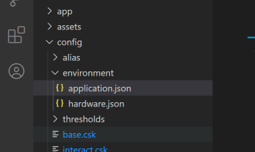

:::note 读完本文后，你将学习到：

- 如何配置使CSK正常录音。

- 如何使CSK输出音频。

- 如何送音频至CSK播放

:::


:::important

在开始探索之前，你需要关注一个配置文件： **application.json** ，录音和音频输出的配置都在该文件中

:::


## 跟我操作

打开 LStudio ，新建/打开一个4002项目，按照下图路径，找到 **application.json** 配置文件。





### 1.配置系统工作模式：

打开配置文件，首先配置系统工作模式。

```json
"business": {
		"sys_mode": "demo",
```

| 字段名   | 类型   | 取值说明                                                     |
| -------- | ------ | ------------------------------------------------------------ |
| sys_mode | String | 默认取值 `Public` 该配置能使 CSK 链接上位机后，由上位机控制录音 |


### 2.配置ADC信息

```json
"adc": {
                "adc_type": "nau85l40",
                "adc_gain": [
                    3,
                    3,
                    10,
                    10
                ],
                "mic_chs": [
                    3,
                    4
                ],
                "ref_chs": [
                    1,
                    1
                ]
            }

```

| 字段名   | 类型           | 取值说明                                                     |
| -------- | -------------- | ------------------------------------------------------------ |
| adc_type | String         | adc类型，取值：<br />- nau85l40；4路录音通道，录音格式:16k32bit4通道。<br />- es7210；4路录音通道，录音格式:16k32bit4通道<br />- es7243e；2路录音通道，录音格式:16k16bit4通道 |
| adc_gain | JSONArray | adc增益，取值：<br />3：表示第1通道的增益大小，范围[0,10]<br />3：表示第2通道的增益大小，范围[0,10]<br />10：表示第3通道的增益大小，范围[0,10]<br />10：表示第4通道的增益大小，范围[0,10] |
| mic_chs  | JSONArray | 表示麦克映射的通道号，根据ADC选型来确定映射数量。<br/>例如：es7210四路录音通道，则映射取值范围为1~4 |
| ref_chs  | JSONArray | 标识回采映射的通道号，根据ADC选型来确定映射数量。<br/>例如：es7210四路录音通道，则映射取值范围为1~4 |


### 3.配置音频输出信息

```json
"hw_config": {
        "usb_mode": {
            "uac_in_enable": false,
            "uac_in_channel": 3,
            "custom_enable": true
        },
        "mic": {
            "type": "amic",
            "dist": 110
        },
        "i2s_out_enable": true,
        "i2s_out_chs": [
            1,
            2,
            5,
            6
        ]
    }
```

| 字段名         | 类型           | 值        | 取值说明                                                     |
| :------------- | :------------- | --------- | ------------------------------------------------------------ |
| uac_in_enable  | boolean        | false     | 该字段表示是否开启UAC，默认关闭；开启UAC后，你可以将CSK当作外挂声卡设备来使用，包括录音和播音。**录音音频格式：16k16bit单通道。** |
| uac_in_channel | int            | 3         | 表示UAC通道数，默认值为3。                                   |
| custom_enable  | boolean        | true      | USB录音开关，默认打开。当 `uac_in_enable` 为 `false` 时用到，**录音音频格式：16k32bit6通道。** |
| type           | String         | amic      | `amic` 表示使用模拟麦，`dmic` 表示使用数字麦。默认取值 `amic`，如需使用数字麦则需联系聆思技术支持对源码修改。 |
| dist           | int            | 110       | 麦克风间距，取值范围35~110mm，推荐使用 `35mm` 或 `110mm` 。  |
| i2s_out_enable | boolean        | true      | 是否使用 i2s 传输音频，默认为 `true` 。                      |
| i2s_out_chs    | JSONArray | [1,2,5,6] | 选择需要获取的音频。   0表示静音，1表示MIC1，2表示MIC2，3表示REF1，4表示REF2，5表示CAE1，6表示CAE2，7表示测试，8表示送往云端识别的音频，其余无效 。**默认选择1，2，5，6路音频。** |

至此，你已经可以通过 CSK 进行录音并通过 i2s 输出音频了！


:::warning

如果你需要送音频到 CSK 中播放，记得将 `uac_in_enable` 设为 `true` 即可

:::