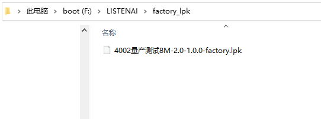
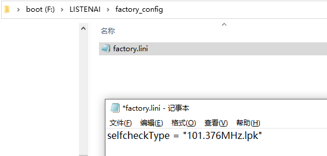
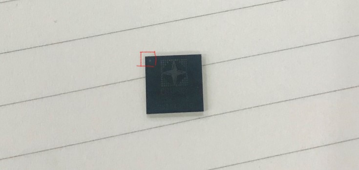

# 芯片烧录器2.1

## 1 烧录器使用指引

### 1.1 烧录器简介

芯片烧录器2.1是面向聆思代理商、方案商等合作伙伴，可配合烧录机台使用的裸芯片烧录工具。

聆思合作伙伴可依据本文档配置烧录器，并配合烧录机台实现一拖多自动化芯片烧录。

### 1.2 功能亮点

①提升烧录效率

支持1拖多（推荐1拖4）烧录，8M固件仅需59s即可烧录完成

② 烧录过程可追溯

增加日志上传功能，可追溯烧录过程，查看烧录座序列号、烧录分区地址、烧录结果等信息。

③ 烧录程序更新便捷

采用树莓派作为烧录控制主机，烧录控制程序更新迭代更容易。

### 1.3 使用方法

​将树莓派作为多个烧录器的控制设备，并将烧录器搭载于烧录机台上，启动烧录机台。机械臂将芯片放置在烧录座子中，烧录器自动开始烧录。烧录结束后，烧录器将烧录结果通过电平信号传递给机台。接到烧录结果后，机台机械臂自动更换芯片，开始下一轮烧录。详细接线与实现方法请查看[2.4上机调试](/tools/mass_production/chipburner#2.4上机调试)。

<div  align="center"></div>

<div  align="center"></div>


### 1.4 维护与报废规范

说明：为提高烧录座的烧录效果和良率，拟以下烧录座维护和报废原则。

**维护规范：**

1. 每次使用前使用汽枪吹干净每个座子。

2. 使用结束后需把所有烧录座上的芯片取出。

3. 每天结束烧录后把烧录座倒过放置，或者使用盖板盖住烧录座，避免进入粉尘影响接触。


**报废规范：**

1. 查看日志系统，确认该烧录座的使用次数是否已经达到5000次。

2. 当烧录座连续出现3PCS芯片不良，查看系统日志均为设备打开失败导致。

3. 使用能烧录OK的芯片手动测试，发现还是无法烧录，日志为打开设备失败。

4. 观察烧录座前5脚（如下图），如果针脚有明显的位移，可尝试使用镊子将针脚复位修复，修复后可以手动测试烧录座，烧录10次有8次能通过则可继续上机使用，否则报废。

## 2 烧录器配置指引

如需配置烧录器，请依照以下指引配置软、硬件，并完成联调。

### 2.1 硬件配置

#### 2.1.1 硬件设计资料

本节提供烧录器硬件设计资料和验收测试标准。

##### 硬件设计资料

[CSK_LOAD V2.1.rar](http://pan.iflytek.com:80/#/link/010457DE846A8D7C3E6D8E21AF131BA2) (访问密码：n5Op)

点击以上链接即可获取硬件框图、原理图、PCB、BOM

图例：

<div  align="center"></div>
<div  align="center"></div>
<div  align="center"></div>

##### 验收标准

烧录器回板后，请按照以下表格进行验收测试，以免电压或掉电时序等不符合要求导致烧录器不稳定。

 [烧录器验收测试模板.xlsx](http://pan.iflytek.com:80/#/link/010457DE846A8D7C3E6D8E21AF131BA2) (访问密码：n5Op)

测试报告样例如下：

 [烧录器验收测试案例.xlsx](http://pan.iflytek.com:80/#/link/010457DE846A8D7C3E6D8E21AF131BA2) (访问密码：n5Op) 


#### 2.1.2 其他配件与规格要求

① 烧录座子（请根据烧录板子数量确定烧录座子数量）：如无特殊需求，推荐使用PLASTRONICS烧录座子，规格见下方文档

 [烧录座子封装_64LQ50S19090.pdf](http://pan.iflytek.com:80/#/link/010457DE846A8D7C3E6D8E21AF131BA2) (访问密码：n5Op) 

② 1*树莓派4B

③ 1*TF卡：≥16G

④ USB2.0打印线 (如图：一头是USB, 另外一头是小方口，数量与烧录板数量保持一致) ：线长≤0.5m：

<div  align="center"></div>

⑤Hub（可选，1拖4及以下不需要配置 接在树莓派上）：京东购买链接：https://item.m.jd.com/product/62280475705.html?gx=RnFiwGFdPDeLwtRP--tzVUaeLn90-OEAjYN0&ad_od=share&utm_source=androidapp&utm_medium=appshare&utm_campaign=t_335139774&utm_term=Wxfriends

:::info 

Hub可能会影响烧录稳定性，请谨慎选择，如无特殊需求请按以上链接购买。

:::

### 2.2 软件配置

#### 2.2.1 将烧录程序写入TF卡

- 用读卡器将TF卡插入电脑

- 下载镜像：[raspios-lsfactory.20210803.img.7z](http://pan.iflytek.com:80/#/link/010457DE846A8D7C3E6D8E21AF131BA2) (访问密码：n5Op)，并解压

- 使用 `balenaEtcher`（以管理员身份运行）将镜像烧写到 TF 卡

   balenaEtcher下载链接：[balenaEtcher](https://www.balena.io/etcher) （windows请选择Windows X86|x64版本）

  

  下图表示烧写成功：
  
  
  
:::info 
  
如烧录失败，请更换读卡器或更换USB口重新烧写，多次重试。
  
:::

#### 2.2.2 自检程序、烧录包配置

##### 制作CSK芯片烧录包（LPK包）

烧录前需要准备芯片烧录所需的LPK包。LISA和非LISA项目需采用不同的打包方法。

- LISA项目：固件确认后，打开LStudio项目，在LStudio终端输入

  ```sh
  lisa build --factory
  ```

  如图：

  

  输入正确的LSCloud项目ID和名称，即可生成芯片烧录所需的lpk包。

- 非LISA项目：打开以下文档链接，并依照操作文档说明打包LPK包

  [芯片烧录包制作工具](/tools/Mass_Production/WebTools/pack)

##### 放置/更换芯片烧录包（LPK包） 

- 将烧写了镜像的TF卡插到电脑上（可使用读卡器），在出现的boot分区中找到`LISTENAI/factory_lpk`目录，并将LPK烧录包存放在该目录下。该目录应当只存放**一个**以 `.lpk` 结尾的固件包。



:::info 

如需更换烧录包，将该目录下的烧录包删除，并存放新的烧录包即可。

:::

##### 放置/更换自检程序

- 在以下链接中下载芯片烧录自检固件，将自检固件存放在`LISTENAI/selfcheck_lpks`目录下

    [101.376MHz.lpk](http://pan.iflytek.com:80/#/link/010457DE846A8D7C3E6D8E21AF131BA2) (访问密码：n5Op) 

##### 设置自检程序 

将烧写了镜像的TF卡插到电脑上（可使用读卡器），在出现的boot分区中找到`LISTENAI/factory_config`目录，以记事本或其他编辑器打开该目录下的`factory.lini`，如图：



将双引号中的内容修改为您按上文步骤放置的自检程序的文件名。

#### 2.2.3 配网

- 将 TF 卡插到电脑上，将[wpa_supplicant.conf](http://pan.iflytek.com:80/#/link/010457DE846A8D7C3E6D8E21AF131BA2) (访问密码：n5Op) 复制到出现的 boot 分区中，如图：


export const Highlight = ({children, color}) => (
  <span
    style={{
      color: color,
}}>
    {children}
  </span>
);

- 将文件中的“<Highlight color="#1877F2">Wi-Fi名称</Highlight>”和"<Highlight color="#1877F2">Wi-Fi密码</Highlight>"分别替换为调试现场或工厂的WiFi名称和密码。

  修改示例：

```txt
ctrl_interface=DIR=/var/run/wpa_supplicant GROUP=netdev
country=CN
network={
    ssid="LINGSI"
    scan_ssid=1
    psk="LS$123456#"
    key_mgmt=WPA-PSK
}
```

- 退出磁盘并将 TF 卡插到树莓派上电。


注：联网成功后该文件会自动消失，如需更换WiFi，重新在boot分区中新建一个`wpa_supplicant.conf`即可，重新上电后原配网信息会被覆盖。

#### 2.2.4 其它

##### 登入树莓派

登入树莓派后，您可查看日志、更新烧录程序。

**方法1**（现场须备有键盘和带有标准HDMI接口的显示器）：

首先将树莓派与键盘、显示器相连接，其次给树莓派上电，输入用户名与密码登录树莓派（默认用户名为pi，密码为raspberry）。登录成功后，即可输入命令行

**方法2**：SSH连接

- 首先保证电脑与树莓派连接同一个路由器，在同一个局域网中。

- 获取树莓派在内网的IP地址

  - 获取方式1：按照以上方法1中的步骤在显示器上打开树莓派终端，执行

    ```sh
    ifconfig -a
    ```

    即可查看树莓派的内网IP

    

  - 获取方式2：点击下载[IP_browser.exe](http://pan.iflytek.com:80/#/link/010457DE846A8D7C3E6D8E21AF131BA2) (访问密码：n5Op) ，在windows电脑打开exe程序，等一会儿，即可查看当前内网下的所有树莓派的IP地址。如获取失败，请确认TF卡中烧录的是否是最新镜像，如不是，请执行./factory/update.sh更新到最新，或联系聆思FAE

- **连接方式1**：下载安装Xshell并打开，点击新建会话，选择SSH协议，并将IP地址填写在主机一栏，点击连接即可

  

  **连接方式2**：打开Windows Powershell（请保证Win OpenSSH已添加到环境变量），执行以下命令

  ```sh
  ssh pi@192.168.10.143
  ```

  注意：pi@后的IP地址仅作示例，请手动替换为您的树莓派对应的IP地址

  输入密码登录树莓派（初始密码为raspberry）

  

##### 更新烧录程序

TF 卡镜像中的软件可能已经过时，需要手动更新到最新版本。打开树莓派终端，执行以下命令更新烧录程序并重启，即可将烧录程序更新到最新。建议每次开始烧录前都进行更新。

```sh
1. ./factory/update.sh
2. sudo reboot now
```

### 2.3 研发调试

本章介绍如何在上烧录机台调试前自测烧录功能是否正常。

软、硬件均按照2.2中的步骤配置完成后，可连接烧录器与树莓派进行调试

#### 硬件接法

- 用USB2.0打印线连接树莓派与烧录器，如图：

<div  align="center"></div>

- 按下树莓派开关启动树莓派，自检固件加载完成后，蓝色指示灯闪烁，表示烧录器已准备就绪
- 将芯片左上角的小圆点对准烧录器中的圆形标识`1`，用镊子或静电笔将芯片放置在烧录座中



<div  align="center"></div>

#### 烧录方法

- 按下图示中的按键，开始烧录

<div  align="center"></div>

- 等待一段时间后（两分钟内），如烧录器显示绿灯，则检测通过、烧录完成，调试成功；如烧录器显示红灯，代表检测不通过或烧录失败，建议打开日志查看问题，或更换芯片重试

#### 日志查看方法

- 方法一：首先登入树莓派，登入方法见本文档2.2 软件配置中的[2.2第5节 登入树莓派](#登入树莓派) ，在默认路径下（/home/pi）执行以下命令即可打开日志：

  ```sh
  ./factory/logs.sh
  ```
图例：

  图中标识处为需要烧录的固件的信息：

   <div  align="center"></div>

  图中标识处为自检固件的频率信息：

   <div  align="center"></div>

  图示表示烧录成功：

   <div  align="center"></div>

- 方法二：使用PC打开[LSCloud](https://cloud.listenai.com/)，进入您制作芯片烧录包时填写的LSCloud项目，点击左侧边栏`日志`，并设置正确的时间区间，即可在烧录完成后查看烧录日志，如图：

  
  
#### 关机方法

需要关机时，请先短接树莓派右侧第3和第5引脚（如图），维持短接状态直到烧录板上的指示灯熄灭（此时树莓派的风扇仍在工作），再按下树莓派的按钮开关断电。

:::danger 注意！

直接断电会导致TF卡损坏。

:::


   <div  align="center"></div>

#### 附：烧录失败原因排查

|                      日志显示的失败原因                      |                         建议排查方向                         |
| :----------------------------------------------------------: | :----------------------------------------------------------: |
|                       自检固件加载失败                       | /boot/LISTENAI/factory_config目录下的factory.lini设置的自检固件名称与/boot/LISTENAI/selfcheck_lpks目录下存放的自检固件名称不一致，请依照[2.2.2 第4节 设置自检固件](#设置自检程序)中的步骤重新设置 |
|                设备打开失败，无法进入烧录模式                | 说明硬件连接失败，建议检查烧录座与芯片引脚是否接触不良，芯片是否放置错误，并按[2.1.1 硬件设计资料](#验收标准)中的验收标准确认烧录板验收测试通过 |
| 自检失败，0x00 \| 自检失败，0x01 \| 自检失败，0x02 \| 自检失败，0x03 \| 自检结果读取超时 | 先确认是否已按[2.1.1 硬件设计资料](#验收标准)中的步骤做完烧录板验收测试；如已验收，可检测引脚接触、供电稳定情况，如调整后仍自检失败，可尝试更换芯片验证 |

### 2.4 上机调试

此章节介绍如何将烧录器配合烧录机台实现自动化烧录。在开始此章前，请确保已按照2.3中的步骤完成树莓派配网，能够正常控制烧录座烧录

#### 硬件接法

- 用USB2.0打印线连接树莓派与烧录器

- 将烧录器固定放置在烧录机台上，并通过信号线连接烧录机台。固定方式如图：

  

  烧录机台信号线可参考以下图片与表格与烧录器相连接：

  
  
  | 烧录器接口 | 对应信号（低电平有效） |
  | :----------: | :--------: |
  | Pin1       | VDD |
  | Pin3       | GND |
  | Pin5       | Busy Signal |
  | Pin7       | OK Signal |
  | Pin8       | START Signal |
  | Pin9       | NG Signal |
  | Pin2、Pin4、Pin6、Pin10 | 备用 |
  


- 完成硬件连接后，等待蓝色状态指示灯闪烁，才可以执行机械臂并发送烧录信号，开始烧录
- 烧录完成后，如机台收到烧录器发送的OK信号，则机械臂取走芯片，放置下一片芯片；如机台收到烧录器发送的NG信号，则机械臂取走芯片再按压到烧录座子中，重新烧录；如连续烧录2或3次（可在机台上设置该次数）均NG，则机械臂取走芯片并放置在特殊区域

##### 指示灯说明

  

- 标记“0”蓝灯闪烁，表示准备就绪，等待烧录
- 标记"1"黄灯闪烁，表示正在烧录
-  标记“2”红灯亮起，表示烧录失败
- 标记“3”绿灯亮起，表示烧录成功


### 可选：校验固件是否成功烧录

固件烧录后，可按照[芯片烧录包校验工具](/tools/Mass_Production/WebTools/verify)中的步骤校验固件是否成功烧录到芯片中。


​        


